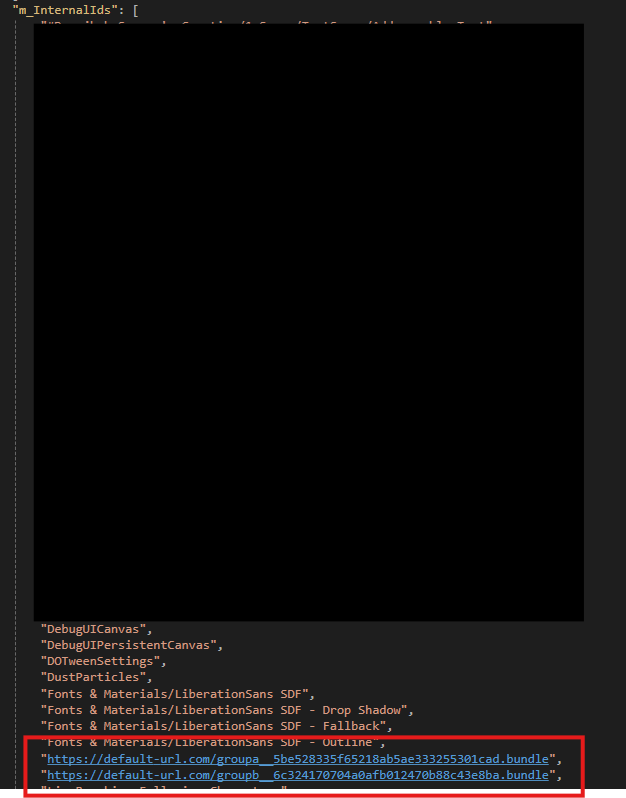

## Addressable

<br>

<기초 사용 방법>

[\[어드레서블\] - 기본 및 사용법](https://dev-junwoo.tistory.com/159)  

[\[어드레서블\] - 서버에서 다운받기](https://dev-junwoo.tistory.com/160)


<br>

> Addressable 구현하며 겪은 어려움

Addressable을 적용하여 제가 얻은 정보들을 작성하겠습니다. 먼저 전체 예제 코드는 다음과 같습니다.

<br>

### 예제 코드

<br>


```
using UnityEngine;


using System.Collections.Generic;
using System.Collections;

using Dev_System;
using Dev_Utils;
using UnityEngine.Networking;
using UnityEngine.AddressableAssets;
using UnityEngine.ResourceManagement.AsyncOperations;


public class AddressableManager : MonoBehaviour
{
    [SerializeField] private string loadPath = string.Empty;


    private List<AsyncOperationHandle> handles = new List<AsyncOperationHandle>();

    private readonly string userId = "";
    private readonly string accessKeyId = "";
    private readonly string secretKey = "";
    private readonly string authURL = "";
    private readonly string defaultURL = "https://default-url.com";


    [SerializeField] private AudioSource audioSource;
    [SerializeField] private SoundDataTable soundDataTable;

    // 테스트
    private void Update()
    {
        if (Input.GetKeyDown(KeyCode.A))
        {
            StartCoroutine(GetAuthTokenAndUpdateAddresable());
        }
        else if (Input.GetKeyDown(KeyCode.S))
        {
            StartCoroutine(InitializeAddressable());
        }


        if (Input.GetKeyDown(KeyCode.Q))
        {
            StartCoroutine(CheckDownloadSize("GroupA"));
        }
        else if (Input.GetKeyDown(KeyCode.W))
        {
            StartCoroutine(DownloadAddressable("GroupA"));
        }
        else if (Input.GetKeyDown(KeyCode.E))
        {
            StartCoroutine(LoadAddressable("SoundDataTable_"));
        }
        else if (Input.GetKeyDown(KeyCode.R))
        {
            ClearAddressable();
        }
        else if (Input.GetKeyDown(KeyCode.T))
        {
            StartCoroutine(CheckKeys("GroupA"));
        }
        else if (Input.GetKeyDown(KeyCode.Y))
        {
            ReleaseHandles();
        }
        else if (Input.GetKeyDown(KeyCode.U))
        {
            TestMusic();
        }
    }

    private IEnumerator InitializeAddressable()
    {
        // 어드레서블 초기화
        yield return Addressables.InitializeAsync();

        UpdateAddressable();
    }

    private void UpdateAddressable()
    {
        Addressables.CheckForCatalogUpdates().Completed += (result) =>
{
    var catalogToUpdate = result.Result;
    if (catalogToUpdate.Count > 0)
    {
        Addressables.UpdateCatalogs(catalogToUpdate).Completed += (result) =>
        {
            Debug.Log($"<color=cyan>[어드레서블] 카탈로그 업데이트 성공! {result.Result.Count}개의 카탈로그 업데이트 완료</color>");
        };
    }
    else
    {
        Debug.Log($"<color=cyan>[어드레서블] 카탈로그 업데이트 없음</color>");
    }
};
    }


    // 다운로드 사이즈 체크하는 메서드드
    private IEnumerator CheckDownloadSize(string label)
    {

        // 그룹 이름으로 다운로드 사이즈 체크
        var handle = Addressables.GetDownloadSizeAsync(label);
        yield return handle;
        if (handle.Status == AsyncOperationStatus.Succeeded)
        {
            long downloadSize = handle.Result;
            if (downloadSize > 0)
            {
                Debug.Log($"<color=cyan>[어드레서블] {label} 다운로드 사이즈: {downloadSize / (1024f * 1024f):F2} MB</color>");
            }
            else
            {
                Debug.Log($"<color=cyan>[어드레서블] {label} 다운로드 사이즈 없음</color>");
            }
        }

        Addressables.Release(handle);
    }

    // 특정 라벨 다운로드 받는 메서드
    private IEnumerator DownloadAddressable(string label)
    {
        // 두 번째 파라미터 true 이면 의존성 다운로드 받음 (즉 다운로드 한 에셋을 캐시에 유지)
        var handle = Addressables.DownloadDependenciesAsync(label, true);

        while (!handle.IsDone)
        {
            Debug.Log($"<color=cyan>[어드레서블] {label} 다운로드 중... {handle.PercentComplete * 100:F2}%</color>");
            yield return null;
        }

        Debug.Log($"<color=cyan>[어드레서블] {label} 다운로드 성공!</color>");
    }

    // 특정 키 로드하는 메서드
    private IEnumerator LoadAddressable(string key)
    {
        var handle = Addressables.LoadAssetAsync<SoundDataTable>(key);
        handles.Add(handle);

        yield return handle;

        if (handle.Status == AsyncOperationStatus.Succeeded)
        {
            if (handle.Result != null)
            {
                Debug.Log($"<color=cyan>[어드레서블] {handle.Result.name} 로드 성공! (Result is not null)</color>");

                //Test
                soundDataTable = handle.Result;

                audioSource.clip = soundDataTable.GetSoundClip(SoundClip_ID.Dance04);
                audioSource.Play();
            }
            else
            {
                Debug.Log($"<color=cyan>[어드레서블] {key} 로드 실패! (Result is null) {handle.OperationException}</color>");
            }

            Debug.Log($"<color=cyan>[어드레서블] {key} 로드 성공!</color>");
        }
        else
        {
            Debug.Log($"<color=cyan>[어드레서블] {key} 로드 실패! {handle.OperationException}</color>");
        }

        yield return new WaitForSeconds(1f);

        //Addressables.Release(handle);
    }

    private IEnumerator CheckKeys(string groupName)
    {
        var locHandle = Addressables.LoadResourceLocationsAsync(groupName);
        yield return locHandle;
        foreach (var loc in locHandle.Result)
        {
            Debug.Log($"Key: {loc.PrimaryKey}, InternalId: {loc.InternalId}");
        }
        Addressables.Release(locHandle);
    }

    private void ClearAddressable()
    {
        Debug.Log($"<color=cyan>[어드레서블] 캐시 삭제 시작!</color>");
        Caching.ClearCache();
    }


    private IEnumerator GetAuthTokenAndUpdateAddresable()
    {
        UnityWebRequest request = UnityWebRequest.Get(authURL);

        string authUser = $"{userId}:{accessKeyId}";

        request.SetRequestHeader("X-Auth-User", authUser);
        request.SetRequestHeader("X-Auth-Key", secretKey);

        yield return request.SendWebRequest();

        if (request.result != UnityWebRequest.Result.Success)
        {
            Debug.LogError($"<color=cyan>[어드래서블] 인증 실패: {request.error}</color>");
            yield break;
        }
        else
        {
            Debug.Log($"<color=cyan>[어드레서블] 인증 성공!</color>");
        }

        string token = request.GetResponseHeader("X-Auth-Token");
        string storageUrl = request.GetResponseHeader("X-Storage-Url");

        // ✅ 최종 LoadPath 주소 조립
#if UNITY_ANDROID
        loadPath = storageUrl + "/unity/폴더명/Android";
#elif UNITY_IOS
            loadPath = storageUrl + "/unity/폴더명/iOS";
#else
            loadPath = storageUrl + "/unity/폴더명/Android";
#endif

        Debug.Log($"<color=cyan>[어드레서블] LoadPath: {loadPath}</color>");

        #region [접근 가능한지 테스트]
        // string catalogPath = loadPath + "/catalog_10001.json";
        // UnityWebRequest catalogRequest = UnityWebRequest.Get(catalogPath);
        // catalogRequest.SetRequestHeader("X-Auth-Token", token);

        // yield return catalogRequest.SendWebRequest();

        // if (catalogRequest.result != UnityWebRequest.Result.Success)
        // {
        //     Debug.LogError($"<color=cyan>[어드레서블] 카탈로그 다운로드 실패: {catalogRequest.error}</color>");
        // }
        // else
        // {
        //     string catalogJson = catalogRequest.downloadHandler.text;
        //     Debug.Log($"<color=cyan>[어드레서블] 카탈로그 다운로드 성공! {catalogJson}</color>");
        // }
        #endregion


        // WebRequest에 토큰 삽입하도록 설정
        Addressables.ResourceManager.WebRequestOverride = (UnityWebRequest request) =>
        {
            Debug.Log($"<color=cyan>[어드레서블] WebRequestOverride: {request.url}</color>");
            request.SetRequestHeader("X-Auth-Token", token);
        };

        Addressables.ResourceManager.InternalIdTransformFunc = (location) =>
        {
            Debug.Log($"<color=cyan>[어드레서블] InternalIdTransformFunc: {location.InternalId}</color>");
            var path = location.InternalId;

            if (path.Contains(defaultURL))
            {
                Debug.Log($"<color=cyan>[어드레서블] InternalIdTransformFunc: {path}</color>");
                return path.Replace(defaultURL, loadPath);
            }
            else
            {
                Debug.Log($"<color=cyan>[어드레서블] InternalIdTransformFunc: {path}</color>");
                return path;
            }
        };
    }

    private void ReleaseHandles()
    {
        foreach (var handle in handles)
        {
            Addressables.Release(handle);
        }
        handles.Clear();
    }

    private void TestMusic()
    {
        audioSource.clip = soundDataTable.GetSoundClip(SoundClip_ID.Dance04);
        audioSource.Play();
    }
```

<br>

<br>

<br>

##### _ps. 기초적인 어드레서블 설정, 어드레서블 빌드 관련은 구글에 정보가 많기 때문에 넘어가겠습니다._

<br>

* * *

<br>

- [**OAuth**](https://www.google.com/search?sca_esv=dbbcd87e5f308596&cs=1&q=OAuth&sa=X&ved=2ahUKEwiZ9oKgk-mOAxXvrVYBHXG4NCcQxccNegQIJBAB&mstk=AUtExfBJmh5IyWddaQKEsfIenZhYjH6I7d40EiYiUypdCic9HTjhkG6XNXC91pxYOdupXn3Pn5BXYp1X3INF5F3ABbMSBYCNfpJXEjGutfQxb7ymfFII3GsxYLHIFnADnyDHS87-B2OfwPjncRmnZ3IY4RK8tubFDOUilVuZnQhjvwIb_TBH5Bw-GYIipRQKjH1qmXKK&csui=3)**를 이용한 인증**

<br>

먼저 회사 프로젝트이기 때문에 공개 범위가 Public인 url을 사용할 수 없었습니다.  
하여 공개 범위가 Private인 url에 접근하기 위하여 인증 절차를 거치는 코드가 필요했고 방식은 다음과 같았습니다.

<br>

인증 절차 : [Object Storage API — swift documentation](https://docs.openstack.org/api-ref/object-store/)

<br>

```
        UnityWebRequest request = UnityWebRequest.Get(authURL);

        string authUser = $"{userId}:{accessKeyId}";

        request.SetRequestHeader("X-Auth-User", authUser);
        request.SetRequestHeader("X-Auth-Key", secretKey);

        yield return request.SendWebRequest();

        if (request.result != UnityWebRequest.Result.Success)
        {
            Debug.LogError($"<color=cyan>[어드래서블] 인증 실패: {request.error}</color>");
            yield break;
        }
        else
        {
            Debug.Log($"<color=cyan>[어드레서블] 인증 성공!</color>");
        }

        string token = request.GetResponseHeader("X-Auth-Token");
        string storageUrl = request.GetResponseHeader("X-Storage-Url");

        // ✅ 최종 LoadPath 주소 조립
#if UNITY_ANDROID
        loadPath = storageUrl + "/unity/폴더명/Android";
#elif UNITY_IOS
            loadPath = storageUrl + "/unity/폴더명/iOS";
#else
            loadPath = storageUrl + "/unity/폴더명/Android";
#endif

        Debug.Log($"<color=cyan>[어드레서블] LoadPath: {loadPath}</color>");
```

<br>

<br>

가장 먼저 token과 storageURL을 얻기 위해 인증 절차를 거칩니다.  
인증 절차를 거친 후 나오는 storageURL + 각 플랫폼 경로를 추가해줍니다.

<br>

```
loadPath = storageUrl + "/unity/폴더명/Android";
```

<br>

이는 catalog.hash, catalog.json, bundle 파일이 있는 최종 경로입니다.


Addresasble 콜백 함수 커스터마이징

해당 경로에 접근하기 위해서는 token이 필요합니다.
해당 경로에 접근할 때마다 token을 추가해주기 위해 다음과 같이 코드를 작성하여 해결하였습니다.

        // WebRequest에 토큰 삽입하도록 설정
        Addressables.ResourceManager.WebRequestOverride = (UnityWebRequest request) =>
        {
            Debug.Log($"<color=cyan>[어드레서블] WebRequestOverride: {request.url}</color>");
            request.SetRequestHeader("X-Auth-Token", token);
        };

Addressables.ResourceManager.WebRequestOverride

해당 콜백은 Addresable이 원격(HTTP/HTTPS)에서 에셋 번들을 다운로드할 때 사용하는 UnityWebRequest를 직접 커스터마이징할 수 있는 콜백입니다.
이 콜백에 메서드를 할당하면, Addressables가 생성하는 모든 UnityWebRequest를 직접 수정할 수 있습니다.
타입은 Action<UnityWebRequest>이며 기본값은 Null입니다.



빌드된 카탈로그를 보면 m\_InternalIds에 [default-url.com](https://default-url.com "https://default-url.com")으로 경로가 설정되어 있습니다. 이는 Remote Load Path를 해당 디폴트 경로로 설정하였기 때문입니다.

이렇게 설정한 이유는 다음과 같습니다.

<br>

- 토큰을 포함한 인증받은 url을 런타임에 받아야 한다.
- 인증 받은 url은 고정되지 않는 url이다. (즉 변하는 url)

<br>

그렇기 때문에 사전에 Load Path에 경로를 설정할 수 없습니다. 이를 해결하기 위해 다음과 같이 코드 작성을 하였습니다.

<br>

```
Addressables.ResourceManager.InternalIdTransformFunc = (location) =>
        {
            Debug.Log($"<color=cyan>[어드레서블] InternalIdTransformFunc: {location.InternalId}</color>");
            var path = location.InternalId;

            if (path.Contains(defaultURL))
            {
                Debug.Log($"<color=cyan>[어드레서블] InternalIdTransformFunc: {path}</color>");
                return path.Replace(defaultURL, loadPath);
            }
            else
            {
                Debug.Log($"<color=cyan>[어드레서블] InternalIdTransformFunc: {path}</color>");
                return path;
            }
        };
```

<br>

```
 Addressables.ResourceManager.InternalIdTransformFunc
```

<br>

해당 콜백은 Addressable이 에셋을 로드할 때 사용하는 Internalid(실제 경로 / URL)을 런타임에 동적으로 변환할 수 있는 콜백입니다.

1. 서버 주소 동적 변경
2. 버전 관리
3. 보안 처리

에 주로 사용하며 저는 서버 주소 동적 변경을 위하여 사용하였습니다. 

<br>

이 모든 작업은 어드레서블이 초기화하기 전에 해줘야 합니다.

<br>

* * *

<br>

- 초기화 코드 + 업데이트 확인 코드

```

    private IEnumerator InitializeAddressable()
    {
        // 어드레서블 초기화
        yield return Addressables.InitializeAsync();

        UpdateAddressable();
    }

    private void UpdateAddressable()
    {
        Addressables.CheckForCatalogUpdates().Completed += (result) =>
{
    var catalogToUpdate = result.Result;
    if (catalogToUpdate.Count > 0)
    {
        Addressables.UpdateCatalogs(catalogToUpdate).Completed += (result) =>
        {
            Debug.Log($"<color=cyan>[어드레서블] 카탈로그 업데이트 성공! {result.Result.Count}개의 카탈로그 업데이트 완료</color>");
        };
    }
    else
    {
        Debug.Log($"<color=cyan>[어드레서블] 카탈로그 업데이트 없음</color>");
    }
};
    }
```

<br>

해당 코드를 통해 초기화 및 서버와 로컬 카탈로그를 비교해 서버 카탈로그가 버전이 높으면 업데이트를 해줍니다.

* * *

<br>

- 다운로드 사이즈 체크

<br>

```
    // 다운로드 사이즈 체크하는 메서드
    private IEnumerator CheckDownloadSize(string label)
    {

        // 그룹 이름으로 다운로드 사이즈 체크
        var handle = Addressables.GetDownloadSizeAsync(label);
        yield return handle;
        if (handle.Status == AsyncOperationStatus.Succeeded)
        {
            long downloadSize = handle.Result;
            if (downloadSize > 0)
            {
                Debug.Log($"<color=cyan>[어드레서블] {label} 다운로드 사이즈: {downloadSize / (1024f * 1024f):F2} MB</color>");
            }
            else
            {
                Debug.Log($"<color=cyan>[어드레서블] {label} 다운로드 사이즈 없음</color>");
            }
        }

        Addressables.Release(handle);
    }
```

<br>

해당 라벨에 다운로드 사이즈를 체크해줍니다.  
나중에 라벨이 많아진다면 모든 라벨을 종합해서 다운로드 사이즈를 측정해주는 코드가 필요할 것입니다.

* * *

<br>

- 다운로드

<br>

```
    // 특정 라벨 다운로드 받는 메서드
    private IEnumerator DownloadAddressable(string label)
    {
        // 두 번째 파라미터 true 이면 의존성 다운로드 받음 (즉 다운로드 한 에셋을 캐시에 유지)
        var handle = Addressables.DownloadDependenciesAsync(label, true);

        while (!handle.IsDone)
        {
            Debug.Log($"<color=cyan>[어드레서블] {label} 다운로드 중... {handle.PercentComplete * 100:F2}%</color>");
            yield return null;
        }

        Debug.Log($"<color=cyan>[어드레서블] {label} 다운로드 성공!</color>");
    }
```

<br>

대망의 다운로드입니다. 특정 라벨을 가지고 있는 모든 오브젝트들을 다운로드 받습니다.  
이 또한 나중에 라벨이 늘어난다면 종합해서 다운로드를 받는 과정이 필요할 것입니다.

DownloadAddressable 해당 메서드에서 두 번째 파라미터가 true면 의존성 다운로드를 받습니다.

<br>

* * *

<br>

- Load

<br>

```
    // 특정 키 로드하는 메서드
    private IEnumerator LoadAddressable(string key)
    {
        var handle = Addressables.LoadAssetAsync<SoundDataTable>(key);
        handles.Add(handle);

        yield return handle;

        if (handle.Status == AsyncOperationStatus.Succeeded)
        {
            if (handle.Result != null)
            {
                Debug.Log($"<color=cyan>[어드레서블] {handle.Result.name} 로드 성공! (Result is not null)</color>");

                //Test
                soundDataTable = handle.Result;

                audioSource.clip = soundDataTable.GetSoundClip(SoundClip_ID.Dance04);
                audioSource.Play();
            }
            else
            {
                Debug.Log($"<color=cyan>[어드레서블] {key} 로드 실패! (Result is null) {handle.OperationException}</color>");
            }

            Debug.Log($"<color=cyan>[어드레서블] {key} 로드 성공!</color>");
        }
        else
        {
            Debug.Log($"<color=cyan>[어드레서블] {key} 로드 실패! {handle.OperationException}</color>");
        }
    }
```

<br>

<br>

현재는 테스트 용이라 SoundDataTable이라는 SO를 받지만 추후 enum을 통해 분리를 해야할 필요가 있습니다.

저는 Scriptable Obejct를 통해 참조된 에셋을 전부 로드하는 구조를 가지려고 합니다.

<br>

* * *

<br>

- 디버그용

<br>

```
    private IEnumerator CheckKeys(string groupName)
    {
        var locHandle = Addressables.LoadResourceLocationsAsync(groupName);
        yield return locHandle;
        foreach (var loc in locHandle.Result)
        {
            Debug.Log($"Key: {loc.PrimaryKey}, InternalId: {loc.InternalId}");
        }
        Addressables.Release(locHandle);
    }

    private void ClearAddressable()
    {
        Debug.Log($"<color=cyan>[어드레서블] 캐시 삭제 시작!</color>");
        Caching.ClearCache();
    }
```

<br>

<br>

<br>

> **생겼던 문제들**

<br>

- Exception: Attempting to use an invalid operation handle

<br>

<br>

<br>

Exception: Attempting to use an invalid operation handle... 어드레서블을 잘 몰랐던 제게 참 무서운 놈이었습니다.

<br>

에러 시 작성했던 코드

```
        // 어드레서블 초기화
        var handle = Addressables.InitializeAsync();
        yield return handle;

        if (handle.Status == AsyncOperationStatus.Succeeded)
        {
            Debug.Log($"<color=cyan>[어드레서블] 어드레서블 초기화 성공!</color>");
        } 
        else
        {
            Debug.Log($"<color=cyan>[어드레서블] 어드레서블 초기화 실패! {handle.OperationException}</color>");
        }
```

<br>

<br>

이 에러 로그는 Unity Addressables에서 **이미 해제되었거나 유효하지 않은 AsyncOperationHandle을 사용하려고 할 때** 발생하는 대표적인 에러입니다.

저는 처음에 이게 초기화가 안되서 나오는 에러 로그인 줄 알았는데 초기화 같은 경우 끝나면 알아서 Release가 된다고 합니다.

<br>

```
yield return handle;
```

<br>

초기화가 다 될때까지 기다린 다음에 Status를 호출하니 생기는 에러 로그였습니다. 그냥 

<br>

```
        if (handle.Status == AsyncOperationStatus.Succeeded)
        {
            Debug.Log($"<color=cyan>[어드레서블] 어드레서블 초기화 성공!</color>");
        } 
        else
        {
            Debug.Log($"<color=cyan>[어드레서블] 어드레서블 초기화 실패! {handle.OperationException}</color>");
        }
```

<br>

이 부분 삭제하니까 초기화도 잘됐습니다. 초기화가 잘 됐는지 아는 방법은  
<br>
C:\\Users\\유저명\\AppData\\LocalLow\\회사\\프로젝트명\\com.unity.addressables  
경로에 catalog.hash, catalog.json 생겼으면 초기화 잘된겁니다.

<br>

- 패치가 안되는 문제

<br>

예를 들어 ver1.0 에서 7mb 크기의 번들이 있고

ver 2.0에서는 7mb를 포함한 10mb를 추가한 번들이 있다면 (17mb)

<br>

기존 유저가 7mb를 다운 받았다면 10mb만 다운 받으면 되는 상황인데  
자꾸 이미 다운받은 파일까지 포함해 17mb를 다운 받는 현상이 있었습니다.

<br>

해결 방법

1. Group을 나누어주거나, Label을 나누어 줍니다. 
2. 그룹 설정에 Bundle mode가 Packing Together면 그룹 안에 모든 오브젝트들이 묶여서 재빌드 됩니다. 이 경우 Hash 값이 달라져 기존 데이터와 비교가 불가능할 것 같습니다. 즉 Packing Together를 고수하고 싶다? Group을 나누고, 한 그룹안에 라벨만 다르게 하고 싶다? Packing Together by Label로 설정하고 라벨을 다르게 추가하면 됩니다.

<br>

이렇게 하면 기존 유저가 Group A를 다운 받은 상태에서 Group B를 추가해 빌드 후 서버에 올려주면 기존 유저는 Group B만 없는 것을 파악 후 Group B만 다운받습니다.

<br>

빌드 시 Update a Privious Build를 해주어야 카탈로그 버전은 유지가 되면서 업데이트가 가능합니다.

<br>

제 생각에 그룹안에 에셋이 추가되고 변경될 정도의 규모가 있는 업데이트면 카탈로그 버전 업데이트해서 서버에 올려서 증분 다운로드 포기하는 것도 좋을 것 같습니다.

<br>