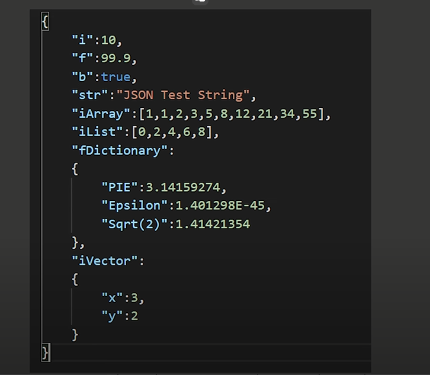

## Today I Learned

### Json

<br>

> 설치 방법

패키지 매니저의 Add Name을 통한 설치 <br>

com.unity.nuget.newtonsoft-json
 
 <br>

> Json?


웹이나 네트워크에서 서버와 클라이언트 사이에  데이터를 주고받을 때 사용하는 개방형 표준 포맷, 쉽게 말하면 서버와 클라이언트가 어떻게 데이터를 주고받을지에 대한 약속같은 것입니다.

XML에 비해 가독성 및 데이터 파싱이 간편합니다.




중요한 점은 Json을 작성 시 Key - Value 형식으로 작성하고 문법 및 오타를 신경써야하며, JsonData와 ClassData의 형식이 정확히 일치해야합니다.

<br>

> 직렬화와 역직렬화

직렬화 : 바이트 배열로 변환 (Json 데이터로 변환)
역직렬화 : 직렬화된 데이터를 객체의 상태로 변환

```csharp
//데이터 직렬화
string jsonData = JsonConvert.SerializeObject(testClass);
Debug.Log(jsonData);

//데이터 역직렬화
JsonTestClass jsonData2 = JsonConvert.DeserializeObject<JsonTestClass>(jsonData);
jsonData2.PrintJsonTestClass();
```

<br>

> **Save & Load**

<br>

```csharp
using Newtonsoft.Json;
using System;
using System.IO; //파일 입출력
using System.Text; //문자열 처리
     
        //Json으로 Save
        private void JsonSave<T>(T data)
	{
		FileStream stream = new FileStream(Application.dataPath + "/test.json", FileMode.OpenOrCreate);

		string jsonData = JsonConvert.SerializeObject(data);
		byte[] bt = Encoding.UTF8.GetBytes(jsonData);
		stream.Write(bt, 0, bt.Length);
		stream.Close();
	}

        //Json을 데이터로 Load
	private T JsonLoad<T>(string path)
	{
		FileStream stream = new FileStream(Application.dataPath + "/" + path, FileMode.Open);
		byte[] data = new byte[stream.Length];
		stream.Read(data, 0, data.Length);
		stream.Close();

		string jsonData = Encoding.UTF8.GetString(data);
                T testclass = JsonConvert.DeserializeObject<T>(jsonData);

		return testclass;
         }
```


<br>

추가 지식 : using 문을 사용하면 Dispose or Close를 안해줘도 해당 구문을 빠져나올 때 Dispose or Close를 해줘 메모리 해제 작업을 진행할 수 있다.

<br>

```csharp
private T JsonLoad<T>(string path)
{
	T testclass;

	using (FileStream stream = new FileStream(Application.dataPath + "/" + path, FileMode.Open))
	{
		try
		{
			byte[] data = new byte[stream.Length];
			stream.Read(data, 0, data.Length);
			string jsonData = Encoding.UTF8.GetString(data);
			testclass = JsonConvert.DeserializeObject<T>(jsonData);
		}
                //혹시나 모를 오류에 대비한 예외처리
		finally
		{ 
			stream?.Close();
		}
	}

	return testclass;
}
```

<br>

> ### **JsonData 클래스 만들기**

<br>


\[Serializable\]를 입력하여 직렬화를 해주고 [GetType().Name](https://GetType\(\).Name "https://GetType().Name") 메서드를 통해 Class 이름을 가져오는 생성자를 만들어줍니다.

<br>

```
[Serializable]
public class JsonData
{
    public string typeName;

    public JsonData()
    {
        typeName = GetType().Name;
    }
}
```

* * *

<br>

JsonData 클래스를 상속받아 저장할 클래스를 만듭니다.

생성자 옆에 base()를 붙여주어 부모클래스의 생성자가 실행되도록 합니다.

<br>

```
[Serializable]
public class PlayerData : JsonData
{
    public Vector3 pos;
    public int level;

    public PlayerData() : base()
    {
        
    }
}
```

<br>

### Json Data 저장하기 (Write)

<br>

JsonUtility.ToJson() 함수를 이용하여 데이터를 Json으로 바꿔줍니다.

file.Directory.Create()는 폴더가 없을 경우 폴더를 만들어줍니다.

<br>

```
private void SaveJsonData(JsonData data)
{
    string jsonData = JsonUtility.ToJson(data);
    string path = GetJsonSavePath(data.typeName);
    var file = new System.IO.FileInfo(path);
    file.Directory.Create();
    System.IO.File.WriteAllText(file.FullName, jsonData);
}
```

<br>

* * *

<br>

```
private string GetJsonSavePath(string typeName)
{
    return string.Format("Assets/JsonResource/{0}.json", typeName);
}

//Application.dataPath를 이용해서 리턴값을 수정해주면 똑같은곳에 저장됩니다.
//return Application.dataPath + string.Format("/JsonResource/{0}.json", typeName);
```

<br>

* * *

<br>

```
private void SavePlayerData()
{
    var playeData = new PlayerData();
    playeData.pos = new Vector3(1, 2, 3);
    playeData.level = 2;

    SaveJsonData(playeData);
}
```

<br>

### Json Data 불러오기 (Read)

<br>

default(T) 는 참조 형식일때 null을 반환합니다.

<br>

```
private T LoadJsonData<T>(string typeName)
{
    string path = GetJsonSavePath(typeName);
    var file = new System.IO.FileInfo(path);

    if (!file.Exists)
    {
        Debug.LogError("파일 없음: " + path);
        return default(T);
    }

    string jsonData = System.IO.File.ReadAllText(file.FullName);

    return JsonUtility.FromJson<T>(jsonData);
}
```

<br>

* * *

<br>

위 함수를 활용해 데이터를 불러옵니다.

<br>

```
private void LoadPlayerData()
{
    PlayerData playerData = new PlayerData();
    playerData = LoadJsonData<PlayerData>(playerData.typeName);

    if(playerData == null) 
    {
        return; 
    }

    Debug.Log("player pos: " + playerData.pos);
    Debug.Log("player level: " + playerData.level);
}
```
