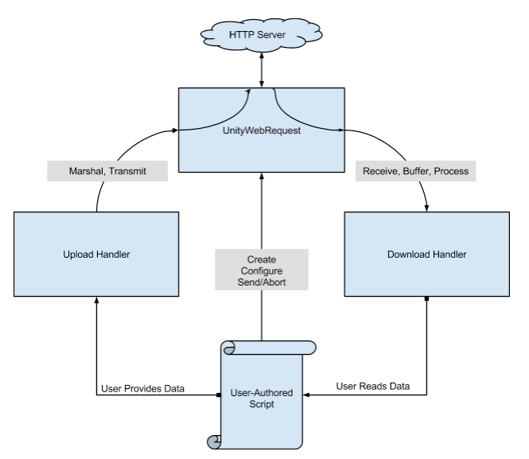

## \[Unity Network\] 유니티에 HTTP 통신하는 방법 (POST, GET)

<br>

> **www**

<br>

www 클래스는 유니티에서 제공하는 간단한 방법으로 웹 서버와 통신할 수 있게 해주는 클래스입니다. 웹 페이지의 데이터를 다운로드하거나, 이미지 등을 불러올 때 사용됩니다.

현재 www는 유니티에서 권장하지 않고 있습니다.

<br>

> **UnityWebRequest**  

<br>

UnityWebRequest 클래스는 유니티에서 HTTP 통신을 할 수 있게 해주는 클래스입니다. GET, POST 등 다양한 HTTP 요청 방식을 지원하며, 파일 다운로드, 업로드 등의 작업에 사용됩니다. 유니티에서 www를 사용하기 보다는 UnityWebRequest를 사용하는 것을 권장합니다.

<br>

<br>

- **GET 방식**
    - GET 방식은 주로 서버로부터 정보를 **==조회==**하기 위해 사용되는 메서드입니다.
    - 데이터를 요청할 때 필요한 매개변수를 URL의 일부로 포함시켜 서버에 전송합니다.
    - URL에 데이터가 붙기 때문에, 전송할 수 있는 데이터의 크기가 제한적이며, 보안상 민감한 데이터를 전송하기에는 부적합할 수 있습니다.

<br>

### GET 소스 코드

<br>

```
IEnumerator GetTextData()
{
    string url = "https://example.com/data.json";
    UnityWebRequest request = UnityWebRequest.Get(url);
    
    yield return request.SendWebRequest();

    if (request.result == UnityWebRequest.Result.Success)
    {
        Debug.Log("받은 데이터: " + request.downloadHandler.text);
    }
    else
    {
        Debug.LogError("요청 실패: " + request.error);
    }
}
```

<br>

```
// Json 다운로드 형식

UnityWebRequest request = UnityWebRequest.Get("https://example.com/data.json");
yield return request.SendWebRequest();
if (request.result == UnityWebRequest.Result.Success)
{
    string jsonText = request.downloadHandler.text;
    Debug.Log(jsonText);
}
```

<br>

```
// Texture2D 다운로드 형식

UnityWebRequest request = UnityWebRequestTexture.GetTexture("https://example.com/image.png");
yield return request.SendWebRequest();
if (request.result == UnityWebRequest.Result.Success)
{
    Texture2D tex = DownloadHandlerTexture.GetContent(request);
    myRenderer.material.mainTexture = tex;
}

// byte[] -> Texture2D 변환
IEnumerator GetTextureFromBytes()
{
    UnityWebRequest request = UnityWebRequest.Get("https://example.com/image.png");
    yield return request.SendWebRequest();

    if (request.result == UnityWebRequest.Result.Success)
    {
        byte[] imageBytes = request.downloadHandler.data;

        Texture2D texture = new Texture2D(2, 2); // 임의 크기, LoadImage가 자동 리사이즈함
        texture.LoadImage(imageBytes); // PNG/JPG 포맷 해석

        // 결과 사용
        GetComponent<Renderer>().material.mainTexture = texture;
    }
    else
    {
        Debug.LogError(request.error);
    }
}
```

<br>

<br>

```
// AudioClip 다운로드 형식

UnityWebRequest request = UnityWebRequestMultimedia.GetAudioClip("https://example.com/sound.mp3", AudioType.MPEG);
yield return request.SendWebRequest();
if (request.result == UnityWebRequest.Result.Success)
{
    AudioClip clip = DownloadHandlerAudioClip.GetContent(request);
    audioSource.clip = clip;
    audioSource.Play();
}
```

<br>

```
// zip 파일 조회 후 압축 해제
// zip 압축 해제를 위해 ICSharpCode.SharpZipLib 설치 필요 (Nuget 통해 설치 가능)

using UnityEngine;
using UnityEngine.Networking;
using System.Collections;
using System.IO;
using ICSharpCode.SharpZipLib.Zip;

IEnumerator DownloadAndUnzip()
{
    string zipUrl = "https://example.com/files/archive.zip";
    string zipPath = Path.Combine(Application.persistentDataPath, "archive.zip");
    string extractPath = Path.Combine(Application.persistentDataPath, "unzipped");

    UnityWebRequest request = UnityWebRequest.Get(zipUrl);
    request.downloadHandler = new DownloadHandlerFile(zipPath);
    yield return request.SendWebRequest();

    if (request.result == UnityWebRequest.Result.Success)
    {
        Debug.Log("ZIP 파일 다운로드 완료");

        // 압축 해제
        using (FileStream fs = File.OpenRead(zipPath))
        using (ZipInputStream zipStream = new ZipInputStream(fs))
        {
            ZipEntry entry;
            while ((entry = zipStream.GetNextEntry()) != null)
            {
                string filePath = Path.Combine(extractPath, entry.Name);
                Directory.CreateDirectory(Path.GetDirectoryName(filePath));

                using (FileStream streamWriter = File.Create(filePath))
                {
                    byte[] buffer = new byte[4096];
                    int size;
                    while ((size = zipStream.Read(buffer, 0, buffer.Length)) > 0)
                    {
                        streamWriter.Write(buffer, 0, size);
                    }
                }

                Debug.Log($"파일 추출: {entry.Name}");
            }
        }
    }
    else
    {
        Debug.LogError("ZIP 다운로드 실패: " + request.error);
    }
}
```

<br>

<br>

<br>

<br>

- **POST 방식**
    - POST 방식은 서버에 데이터를 **==전송==**할 때 사용됩니다. 일반적으로 로그인, 업로드 등에 사용합니다.

<br>

### POST 소스 코드

<br>

```
// 기초 소스 코드

IEnumerator PostJsonData()
{
    string url = "https://example.com/upload";
    string json = "{\"name\":\"chatgpt\",\"score\":100}";

    UnityWebRequest request = new UnityWebRequest(url, "POST");
    byte[] jsonToSend = new System.Text.UTF8Encoding().GetBytes(json);
    request.uploadHandler = new UploadHandlerRaw(jsonToSend);
    request.downloadHandler = new DownloadHandlerBuffer();
    request.SetRequestHeader("Content-Type", "application/json");

    yield return request.SendWebRequest();

    if (request.result == UnityWebRequest.Result.Success)
    {
        Debug.Log("응답: " + request.downloadHandler.text);
    }
    else
    {
        Debug.LogError("요청 실패: " + request.error);
    }
}
```

<br>

<br>

```
// 로컬에 있는 Json 파일 전송

IEnumerator PostLocalJsonFile()
{
    string filePath = Path.Combine(Application.streamingAssetsPath, "myData.json");
    string jsonData = File.ReadAllText(filePath);

    UnityWebRequest request = new UnityWebRequest("https://example.com/upload", "POST");
    byte[] bodyRaw = System.Text.Encoding.UTF8.GetBytes(jsonData);
    request.uploadHandler = new UploadHandlerRaw(bodyRaw);
    request.downloadHandler = new DownloadHandlerBuffer();
    request.SetRequestHeader("Content-Type", "application/json");

    yield return request.SendWebRequest();

    if (request.result == UnityWebRequest.Result.Success)
    {
        Debug.Log("JSON 전송 완료: " + request.downloadHandler.text);
    }
    else
    {
        Debug.LogError("전송 실패: " + request.error);
    }
}
```

<br>

<br>

```
// 로컬에 있는 zip 파일 전송

IEnumerator PostLocalZipFile()
{
    string zipFilePath = Path.Combine(Application.persistentDataPath, "archive.zip");
    byte[] zipBytes = File.ReadAllBytes(zipFilePath);

    UnityWebRequest request = new UnityWebRequest("https://example.com/upload", "POST");
    request.uploadHandler = new UploadHandlerRaw(zipBytes);
    request.downloadHandler = new DownloadHandlerBuffer();
    request.SetRequestHeader("Content-Type", "application/zip");

    yield return request.SendWebRequest();

    if (request.result == UnityWebRequest.Result.Success)
    {
        Debug.Log("ZIP 전송 완료: " + request.downloadHandler.text);
    }
    else
    {
        Debug.LogError("전송 실패: " + request.error);
    }
}
```

<br>

```
// 텍스처(Texture 2D) 전송 (png 변환 후)

IEnumerator PostTexture(Texture2D texture)
{
    byte[] pngData = texture.EncodeToPNG();

    UnityWebRequest request = new UnityWebRequest("https://example.com/upload", "POST");
    request.uploadHandler = new UploadHandlerRaw(pngData);
    request.downloadHandler = new DownloadHandlerBuffer();
    request.SetRequestHeader("Content-Type", "image/png");

    yield return request.SendWebRequest();

    if (request.result == UnityWebRequest.Result.Success)
    {
        Debug.Log("텍스처 전송 완료");
    }
    else
    {
        Debug.LogError("전송 실패: " + request.error);
    }
}
```

<br>

<br>

```
// 비디오 또는 오디오 전송 (바이너리 그대로)

IEnumerator PostMediaFile(string mediaPath, string mimeType)
{
    byte[] mediaBytes = File.ReadAllBytes(mediaPath);

    UnityWebRequest request = new UnityWebRequest("https://example.com/upload", "POST");
    request.uploadHandler = new UploadHandlerRaw(mediaBytes);
    request.downloadHandler = new DownloadHandlerBuffer();
    request.SetRequestHeader("Content-Type", mimeType); // 예: "video/mp4" 또는 "audio/mpeg"

    yield return request.SendWebRequest();

    if (request.result == UnityWebRequest.Result.Success)
    {
        Debug.Log("미디어 파일 전송 완료");
    }
    else
    {
        Debug.LogError("전송 실패: " + request.error);
    }
}

// 사용 예시
StartCoroutine(PostMediaFile(Application.streamingAssetsPath + "/sample.mp4", "video/mp4"));
StartCoroutine(PostMediaFile(Application.streamingAssetsPath + "/sound.mp3", "audio/mpeg"));
```

<br>

<br>

<br>

<br>

<br>

<br>

> **UploadHandler**

<br>

- UploadHandlerRaw
    - 바이트 배열을 그대로 서버에 전송할 때 사용됩니다. Json, 바이너리 등

<br>

* * *

<br>

- UploadHandlerFile
    - 로컬 파일을 그대로 서버에 업로드할 때 사용합니다.

<br>

```
UnityWebRequest request = UnityWebRequest.Put("https://example.com/upload", "Assets/Data/file.txt");
request.uploadHandler = new UploadHandlerFile("Assets/Data/file.txt");
yield return request.SendWebRequest();
```

<br>

* * *

<br>

- UploadHanlderFormData
    - 폼 데이터를 서버로 보낼 때 사용합니다.

<br>

```
List<IMultipartFormSection> formData = new List<IMultipartFormSection>();
formData.Add(new MultipartFormDataSection("field1", "value1"));
formData.Add(new MultipartFormDataSection("field2", "value2"));

UnityWebRequest request = UnityWebRequest.Post("https://example.com/form", formData);
yield return request.SendWebRequest();
```

<br>

* * *

<br>

> **DownloadHandler**

<br>

- DownloadHandlerBuffer
    - 텍스트나 Json 등의 일반 데이터를 메모리로 바로 가져올 때 사용합니다.

<br>

* * *

<br>

- DownloadHandlerFile
    - 다운로드 데이터를 직접 디스크에 저장할 때 사용합니다.

<br>

```
string savePath = Application.persistentDataPath + "/file.json";
UnityWebRequest request = UnityWebRequest.Get("https://example.com/data.json");
request.downloadHandler = new DownloadHandlerFile(savePath);
yield return request.SendWebRequest();
```

<br>

* * *

<br>

- DownloadHandlerAssetBundle
    - 에셋 번들을 다운로드하고 메모리상에서 바로 로드할 때 사용합니다.

<br>

```
string url = "https://example.com/bundle";
UnityWebRequest request = UnityWebRequestAssetBundle.GetAssetBundle(url);
yield return request.SendWebRequest();

if (request.result == UnityWebRequest.Result.Success)
{
    AssetBundle bundle = DownloadHandlerAssetBundle.GetContent(request);
    GameObject prefab = bundle.LoadAsset<GameObject>("MyPrefab");
    Instantiate(prefab);
}
```

<br>

<br>

> **📘 UnityWebRequest의 작업 흐름**

<br>



<br>

1. 요청 생성 (`UnityWebRequest.Get/Post/Put/...`)
2. 필요 시 `uploadHandler`, `downloadHandler` 지정
3. 요청 보내기 (`SendWebRequest`)
4. 완료되면 `result`, `downloadHandler.text` 또는 `GetContent()` 등으로 결과 확인