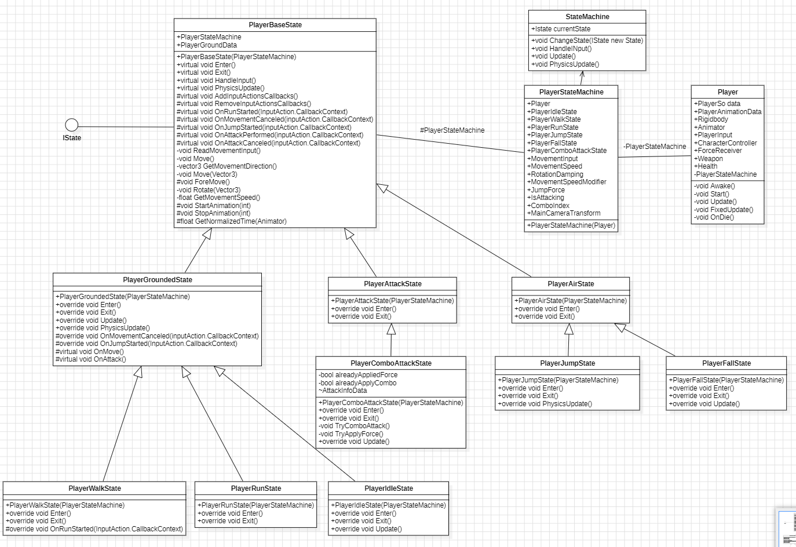

## Today I Learned

> ### FSM (Finite-State Machine)

<br>

> FSM이란?

  

게임 에이전트에게 지능을 부여하기 위한 선택 도구로 사용되어왔다.

유한 상태 기계는 주어지는 모든 시간에 처해질 수 있는 유한 개의 상태를 가지고 주어지는 입력에 따라 어떤 상태에서 다른 상태로 전환 혹은 출력, 액션이 일어나게 하는 장치를 나타낸 모델이다.

여러 개의 제한된 상태(State)가 존재, 그 상태가 특정 조건에 물려 서로 연결되어있는 형태다.

  

- FSM은 유한 상태 기계를 나타내는 디자인 패턴입니다
- 상태와 상태 간의 전환을 기반으로 동작하는 동작 기반 시스템입니다

<br> 



  
<br>

> FSM의 구성 요소  

  

- 상태 (State): 시스템이 취할 수 있는 다양한 상태를 나타냅니다.
- 전환 조건 (Transition Condition): 상태 간 전환을 결정하는 조건입니다.
- 동작 (Action): 상태에 따라 수행되는 동작 또는 로직을 나타냅니다.

  <br>

> 장점

  

- 상태를 명확하게 정의하고 상태 간 전환을 일관되게 관리할 수 있습니다.
- 복잡한 동작을 상태와 전환 조건으로 나누어 구현하므로 코드 유지 보수가 용이합니다.
- 다양한 동작을 유기적으로 조합하여 원하는 동작을 구현할 수 있습니다.

  
<br>
  

- 예시
    - 상태: 정지 상태, 이동 상태, 점프 상태
    - 전환 조건: 이동 입력, 점프 입력, 충돌 등의 조건
    - 동작: 이동 애니메이션 재생, 점프 처리, 이동 속도 조정 등

  
<br>
  

> 예제 코드

  

- AIState (interface)

```csharp
using System.Collections;
using System.Collections.Generic;
using UnityEngine;

public enum AiStateID
{
    ChasePlayer,
    Death,
    Idle,
    FindWeapon,
    Shooting,
    RandomMove,
    Reload,
}

public interface AIState
{
    AiStateID GetID();
    void Enter(AIAgent agent);
    void AIUpdate(AIAgent agent);
    void Exit(AIAgent agent);
}
```

  

AiStateID는 상태들을 ID라고 할 수 있다. 해당 ID를 통해 전환 혹은 확인 등을 할 수 있다.

  

- AIStateMachine

```csharp
using System.Collections;
using System.Collections.Generic;
using UnityEngine;

public class AIStateMachine
{
    public AIState[] states;
    public AIAgent agent;
    public AiStateID currentState;

    public AIStateMachine(AIAgent agent)
    {
        this.agent = agent;
        int numStates = System.Enum.GetNames(typeof(AiStateID)).Length;
        states = new AIState[numStates];
    }

    public void RegsisterState(AIState state)
    {
        int index = (int)state.GetID();
        states[index] = state;
    }

    public AIState GetState(AiStateID stateID)
    {
        int index = (int)stateID;
        return states[index];
    }

    public void Update()
    {
        GetState(currentState)?.AIUpdate(agent);
    }

    public void ChangeState(AiStateID newstate)
    {
        GetState(currentState)?.Exit(agent);
        currentState = newstate;
        GetState(currentState)?.Enter(agent);
    }
}
```

  

- AIAgent

```csharp
using System.Collections;
using System.Collections.Generic;
using UnityEngine;
using UnityEngine.AI;

public class AIAgent : MonoBehaviour
{
    [HideInInspector]
    public HelicStateMachine stateMachine;

    [Header("Helicopter StartState")]
    public HelicStateID initalState;


    private void Awake()
    {
        stateMachine = new HelicStateMachine(this);

        #region [State 등록]

        stateMachine.RegsisterState(new RandomMoveState());
        stateMachine.RegsisterState(new ChasePlayerState());
        stateMachine.RegsisterState(new ShootingState());
        stateMachine.RegsisterState(new BackMoveState());
        stateMachine.RegsisterState(new DieState());

        #endregion

        stateMachine.ChangeState(initalState);
    }

    private void Update()
    {
        stateMachine.Update();
    }
}
```

  

AI 대리자가 상태머신를 관리하고 Update를 돌려주는 역할을 한다.

  

  

- AIState 인터페이스 상속 받은 구현 부

```csharp
using System.Collections;
using System.Collections.Generic;
using UnityEngine;

public class AIIdleState : AIState
{
    public AiStateID GetID()
    {
        return AiStateID.Idle;
    }

    public void Enter(AIAgent agent)
    {
         //todo : Start
    }

    public void AIUpdate(AIAgent agent)
    {
         //todo : Update or While
    }

    public void Exit(AIAgent agent)
    {
         //todo : Exit
    }
}
```
