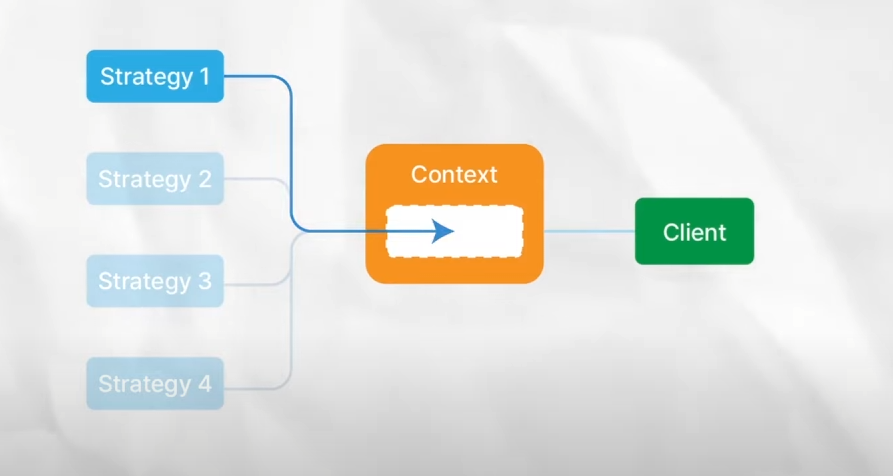
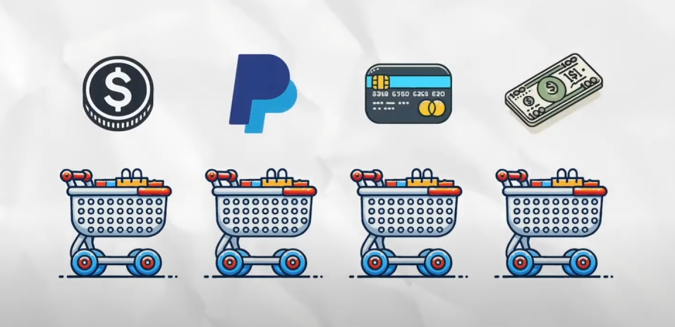
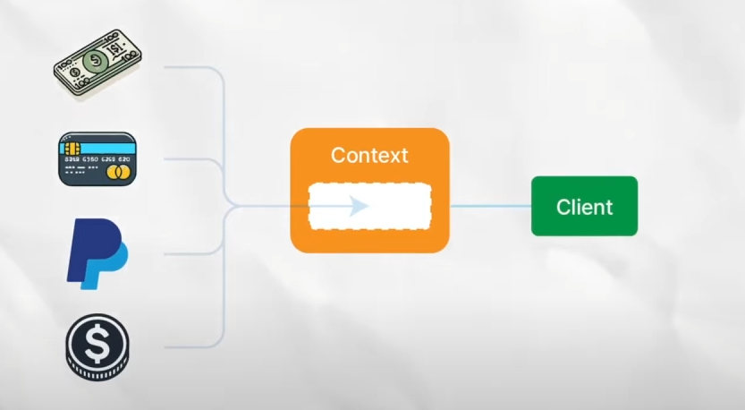

## Today I Learned

> ### Strategy Pattern

[출처 및 참고 : 얕팍한 코딩 사전](https://www.youtube.com/watch?v=xlaAiHrZN3U "https://www.youtube.com/watch?v=xlaAiHrZN3U")

  

> **전략 패턴이란?**

  


  

특정 작업을 하는 방식들, 이른바 ‘전략’들을 여럿 두고 이들을 필요에 따라 ‘갈아끼울’ 수 있도록 하는 패턴입니다. 즉 어떤 일을 하는 것에 대한 여러 ‘모드’들을 각각 클래스로 만들고 이들을 필요에 따라 선택해서 쓰는 것이라고 생각하면 됩니다.



  

쇼핑 카트가 여러 개 있을 때 이들 모두 ‘계산’이라는 작업을 합니다. 하지만 계산을 하는 방법에는 이미지와 같이 여러 방법이 존재합니다. 이 옵션들이 모두 모드, 전략이 되는 것입니다.

  


  
<br>
  

> 예제 코드

  

```csharp
interface PaymentStrategy
{
   void Pay(int amount);
}

//신용 카드 결제 전략
public class CreditCardPayment : PaymentStrategy
{
   private string name;
   private string cardNumber;

   public CreditCardPayment(string name, string cardNumber)
   {
      this.name = name;
      this.cardNumber = cardNumber;
   }

   public override void Pay(int amount)
   {
       //신용 카드 결제 로직
   }
}

//PayPal 결제 전략
public class PayPalPayment : PaymentStrategy
{
   private string email;

   public PayPalPayment(string email)
   {
      this.email = email;
   }

   public override void Pay(int amount)
   {
       //PayPal 결제 로직
   }
}

//Context Class
public class ShoppingCart
{
   private PaymentStrategy paymentStrategy;


   public void SetPaymentStrategy(PaymentStrategy paymentStrategy)
   {
      this.paymentStrategy = paymentStrategy;
   }

   public void CheckOut(int amount)
   {
      paymentStrategy.pay(amount);
   }

}
```

  

  
<br>
  

> 마무리
 

전략 패턴은 특정 기능을 수행하기 위한 여러 알고리즘을 별도의 캡슐로 분리함으로써 코드 실행 중 얼마든지 교체할 수 있도록 해줍니다. 새로운 방식이 필요하다면 또 다른 전략 클래스를 만들어 확장에 용이하고 다른 곳에 재사용 및 수정도 용이합니다.