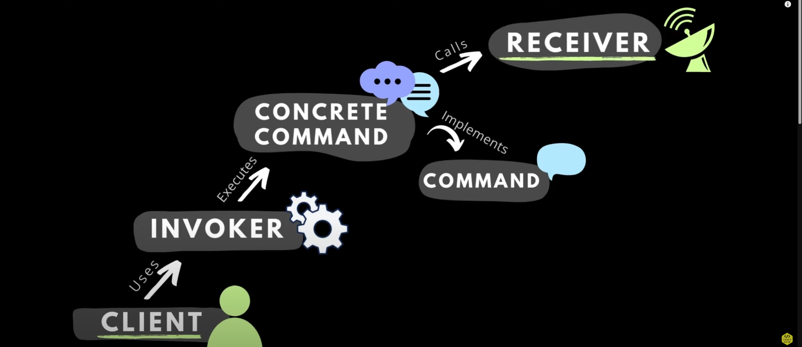
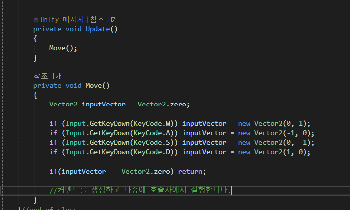
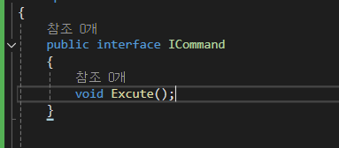
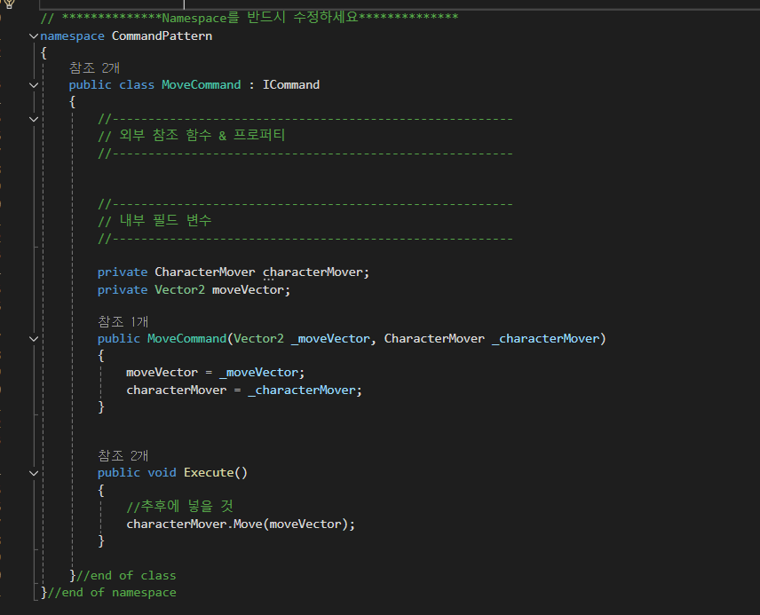
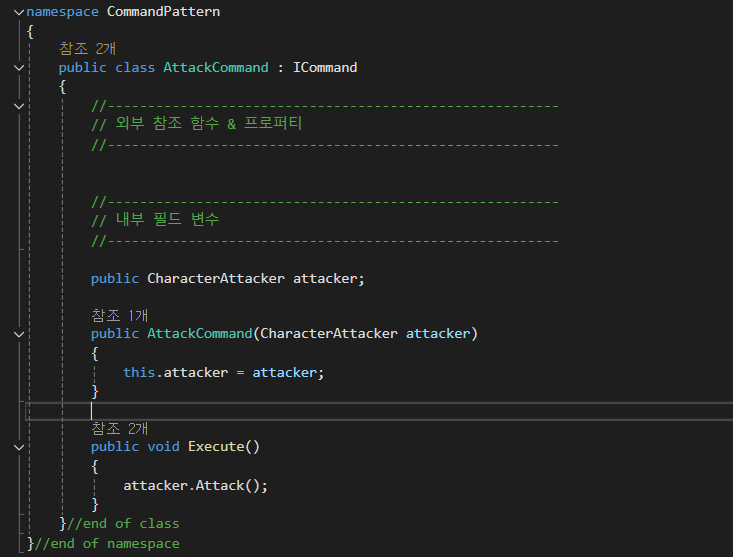
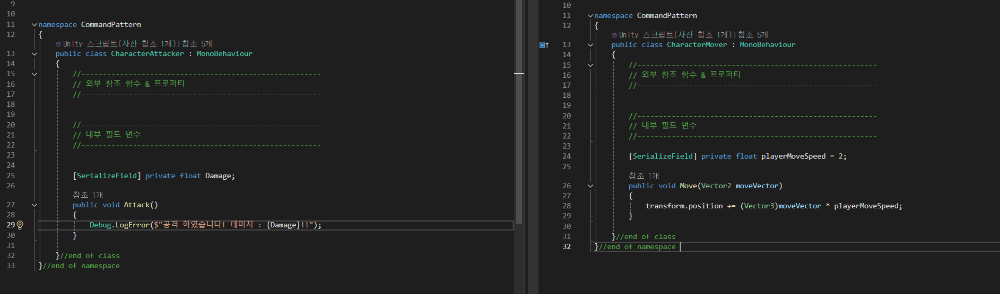
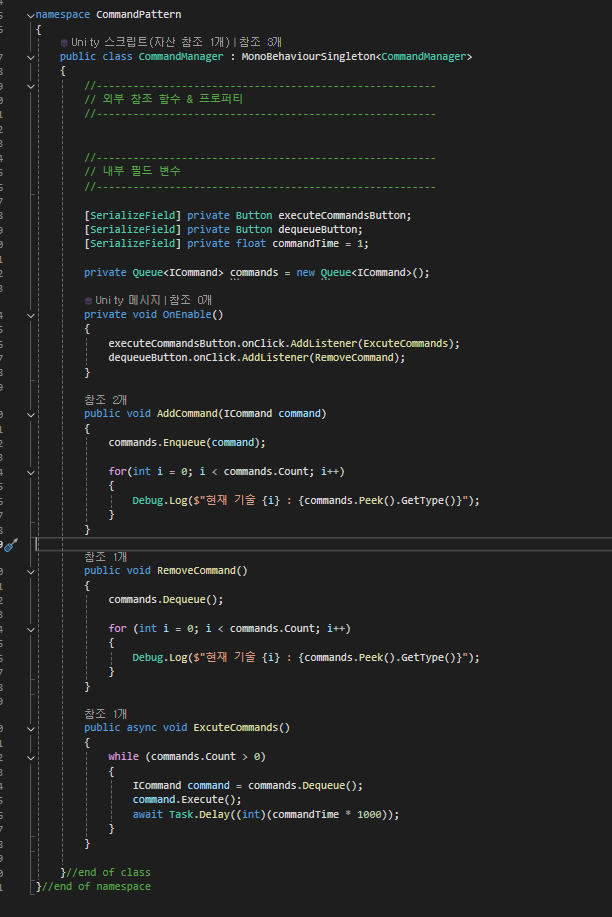
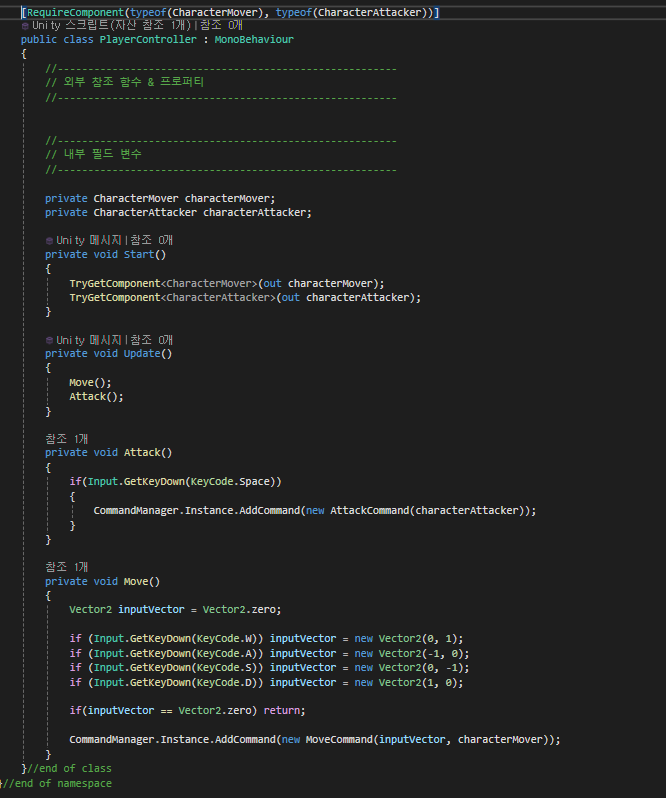

## Today I Learned

* [참고](https://www.youtube.com/watch?v=wAmnVmFeDEM)

> Command Pattern

- 커맨드 패턴

<b>요청을 객체의 형태로 캡슐화</b>하여 사용자가 보낸 요청을 나중에 이용할 수 있도록 메서드 이름, 매개변수 등 요청에 필요한 정보를 저장 또는 로깅, 취소할 수 있게하는 패턴

> Client

Client는 주문하는 역할

> ICommand

Command는 넓은 의미의 커맨드로 Excute() 함수만을 넣어 오버라이딩하게 한다.

> Concrete Commands (구체적인)

구체적으로 객체화할 명령이다.
이러한 명령들은 대리자를 통해 관리된다.

> 대리자 (Agent)

대리자는 객체화한 명령을 실행시킬 객체다.

> Command

커맨드 패턴의 핵심인 Command Manager

해당 스크립트에서는 객체화된 요청을 자료구조에 담아서 관리하는 역할을 한다.

등록하는 예시는 위 이미지와 같다.

> 마무리

- 커맨드 패턴은 메서드를 객체화 시킨다는 것이 핵심으로 객체화된 메서드는 담아두고 유연하게 관리할 수 있다는 장점이 있다.

- 담아두기 때문에 뒤로 돌리거나 취소 또한 할 수 있으며 특정 오브젝트에게 명령을 하는 등 여러 오브젝트를 관리할 때 용이하다.