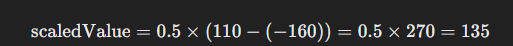

## Today I Learned

### **MAP 수학 공식**

<br>

> Map 수학 공식이란?

A 값의 범위를 B의 값의 범위로 변환하고 싶을 때 사용하는 수학 공식!

예를 들어 0~100이라는 값의 범위를 -100~0이라는 값의 범위로 변경하고 싶을 때 사용합니다.


  <br>

> 문제 정의

  

어떤 값 `value`가 주어졌을 때, 이 값을 `[inMin, inMax]` 범위에서 `[outMin, outMax]` 범위로 변환해야 합니다.

<br>

> 수학적 풀이  

- **입력 범위와 출력 범위 설정:**

주어진 입력 범위는 `[inMin, inMax]`이고, 변환할 출력 범위는 `[outMin, outMax]`입니다.

<br>

- **입력 값을 0에서 1 사이의 비율로 변환:**

먼저, `value`가 `[inMin, inMax]` 범위 내에서 어디에 위치하는지를 계산합니다. 이를 위해 `value`를 `inMin`으로 이동시키고, `inMax - inMin`으로 나눕니다. 이렇게 하면 `value`의 위치를 0에서 1 사이의 비율로 변환할 수 있습니다.


여기서 `normalizedValue`는 `0`에서 `1` 사이의 값이 됩니다.

<br> 

- **출력 범위로 스케일 변환:**

이제 `normalizedValue`를 출력 범위로 스케일링합니다. 출력 범위의 크기는 `outMax - outMin`이므로, 이를 곱해줍니다.


<br>

- **출력 범위의 시작점을 더하기:**

마지막으로, `outMin`을 더하여 출력 범위의 시작점을 맞춥니다.


이 과정은 단순히 값을 출력 범위로 이동시키는 것입니다.

<br>  

- **전체 식:**

위 과정을 하나로 합치면 다음과 같은 수식이 나옵니다.


이것이 바로 `Map` 함수의 핵심 계산 방식입니다.

  
<br>
  

> 예제


- 예를 들어, `value = 50`, `inMin = 0`, `inMax = 100`, `outMin = -160`, `outMax = 110`이라고 가정하면:

1. **입력 값을 0과 1 사이로 변환:**


2. **출력 범위로 스케일링:**



3. **출력 범위의 시작점을 더하기:**


<br>

따라서, `value = 50`은 `[0, 100]` 범위에서는 `[ -160, 110]` 범위의 `-25`에 해당합니다.

이 과정은 `Map` 함수를 사용하여 선형적으로 값을 변환하는 원리입니다.

<br>

> Example Code

```csharp
private float Mapping(float value, float inMin, float inMax, float outMin, float outMax)
{
    return (value - inMin) * (outMax - (outMin)) / (inMax - inMin) + (outMin);
}

// 사용 예시
float originalValue = 0f; // 변환할 값
float mappedValue = Map(originalValue, 0f, 100f, -160f, 110f);

Debug.Log("Mapped Value: " + mappedValue);
```