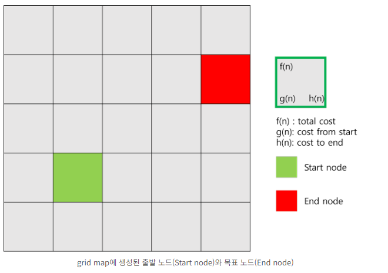
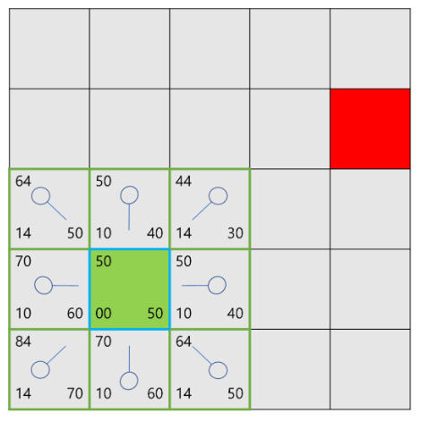
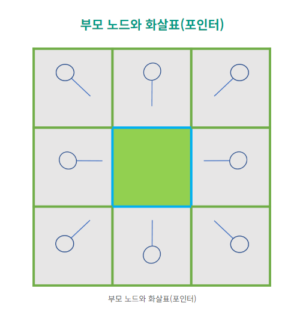
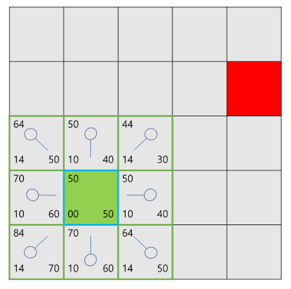
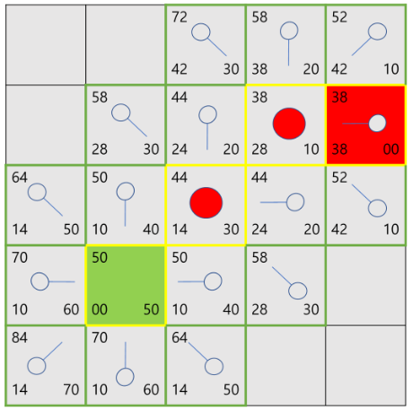

## Today I Learned

### **Astar 알고리즘**

> **A\* Algorithm이란?**

A\* 알고리즘은 주어진 출발 노드에서부터 목표 노트까지 가는 최단 경로를 찾아내는 그래프 탐색 알고리즘 중 하나입니다. 이 알고리즘은 Dijkstara\` Algorithm과 유사하나 차이점은 목표 노드까지의 휴리스틱도 사용한다는 점입니다.

  

현재 노드와 도착 노드의 휴리스틱 계산을 통해 편향적인 노드 탐색을 하여 보다 효율적으로 길을 찾는 알고리즘입니다.

  

Ps. 저 같은 경우 Wartales 프로젝트에서 현재 지점에서 도착 지점까지 최대한 대각선 코스트로 이동 후 남은 거리를 직선 코스트로 가는 휴리스틱을 사용하였습니다.

 
  

> **A\* algorithm 구현**

단도직입적으로 A\* 알고리즘이 어떤 식으로 구현되는지 알아보겠습니다. 일단 아래와 같이 격자 지도를 생성하여 지도를 단순화합니다. 이때 오각형, 육각형, 직사각형 등의 격자를 사용하지 않고 정사각형 격자를 쓴 이유는 가장 단순한 모양이기 때문에 성능 저하를 막고 빠르게 처리할 수 있기 때문입니다. 그리고 생성된 격자 지도에서 출발 지점과 목표 지점을 임의로 지정하였습니다. 여기서 각 사각형의 중심점을 노드라고 부르기로 하겠습니다. 각 사각형은 \[이동 가능\]하거나 또는 장애물이 있어서 \[이동 불가능\]한 2가지 상태 중 하나를 갖습니다. 이때 A\* 알고리즘의 목적은 주어진 아래 지도에서 출발 지점과 목표 지점 사이의 최단 거리를 찾는 것입니다.

 
  
**비용 계산**

f(n), g(n), h(n)이라는 표시가 있는데 이는 비용을 뜻합니다. 경로를 탐색하기 위해서는 각 노드마다 이동에 소요되는 비용 계산이 필요한데, 이중 가장 작은 비용을 가진 사각형들을 서로 이으면 시작 지점과 목표 지점을 잇는 경로가 생성이 됩니다. 각 비용이 적게 드는 node끼리 연결했으므로 찾아낸 경로가 최단 경로라고 짐작할 수 있습니다. 각 비용의 의미는 다음과 같습니다.

 

### **비용 계산 내용**

Heuristic cost function : f(n) = g(n) + h(n)

  
g(n) : 출발 노드에서 현재 노드 n까지 도달하기 위한 최단 비용

  

h(n) : 현재 노드에서 목표 노드까지의 예상 이동 비용으로, 휴리스틱 거리 측정값

  

f(n) : g + h한 총 비용

  
  

자세하게 설명하자면, g(n)은 출발 노드에서 현재 노드까지의 이동하는 데 드는 최소 이동 비용을 일컫습니다. g(n)은 유클리디안 거리를 사용하여 나타내기로 합니다. 가로/세로 한 칸 이동당 10을, 대각선 한 칸 이동은 14로 설정하기로 합니다. 대각선 한 칸 이동이 14인 이유는 피타고라스 정리에 따라 대각선의 이동 거리는 가로 / 세로 이동 거리의 1.414배이기 때문입니다. 이때 정확하게 계산하면 14.14가 되는데 소수보다는 정수가 컴퓨터가 처리하는 데 더 빠르므로 소수점을 제외하여 14라고 설정합니다. 만약 출발 노드에서 현재 노드까지 오는데 가로 한 칸 이동, 세로 한 칸 이동, 대각선 한 칸 이동이라면 g(n) = 10 + 10 + 14가 되는 것입니다. 여기서 g(n)은 노드의 왼쪽 아래에 표기하기로 합니다.

  

그 다음으로 h(n)은 다양한 측정 방식을 사용할 수 있는데 여기서는 맨하튼 거리를 사용하기로 합니다. 해당 방식의 이름의 유래는 미국의 도시 중 하나인 맨하탄으로부터 유래됐습니다. 맨하탄에는 블록마다 건물이 빽빽하게 들어가 있기 때문에 두 지점 사이를 오갈 때 대각선으로는 갈 수 없고 오직 가로/세로로만 이동할 수 있는데, 이와 같은 방식으로 거리를 계산하기 때문에 맨하탄 거리라고 명명되었습니다. 이름의 유래처럼, 이 방식은 현재 노드에서 목표 노드까지 도달하기 위한 이동에서 대각선 이동을 제외하고 오직 가로 / 수직 이동만의 비용을 계산합니다. 가로 / 세로 한 칸당 10이 더해집니다. 만약 가로 가로 2칸, 세로 3칸을 이동한 경우 총 5칸을 이동했으므로 h(n) = 50이 되는 것입니다. h(n)은 오른쪽 아래에 표기하기로 했습니다.

  

마지막으로 f(n)은 앞서 말했듯이 g(n) + h(n)입니다. f(n) 값을 통해 가장 작은 비용을 판단합니다. 보통 노드 왼쪽 위에 표기합니다.

  

 
  

- **경로 탐색 1**

최단 경로 탐색을 위해 아래와 같은 순서로 탐색을 시작합니다. 출발 노드부터 목표 노드까지 인접한 사각형을 확인해 가면서 경로를 만들어 나갑니다.

  

1. 출발 노드를 Open List에 넣어줍니다. 이 목록은 일종의 장바구니와 같습니다. 지금은 출발 노드만 있지만 탐색하면서 점차 늘어날 것입니다. 이때 열린 목록에 있는 노드는 초록 윤곽선으로 둘러싸서 표현하겠습니다.

  

2. 출발 사각형에 인접한 장애물은 무시하고 지나갈 수 있는 사각형을 Open List에 넣어 준다. 이 노드들은 출발 노드로 지정합니다. (이때 부모 노드는 경로를 다 찾고 거슬러 올라갈 때 사용합니다.) 출발 노드를 비롯한 열린 목록에 있는 사각형들의 f, g, h 비용들을 계산하여 각각의 노드에 기입해줍니다.

  

3. Open List에서 출발 사각형을 없애고 다시 볼 필요 없는 Closed List에 추가해 줍니다. 이때 닫힌 목록에 있는 노드는 하늘색 윤곽선으로 둘러싸서 표현합니다.

 

위 그림에서 가운데 있는 초록 사각형은 출발 노드이다. 하늘색 윤곽선 테두리는 출발 노드가 Closed List에 추가가 되어 더 이상 볼 필요가 없다는 것을 의미합니다. 그리고 출발 노드에 인접한 8개의 노드는 초록 윤곽선으로 둘러싸여 있습니다. 이는 Open List에 들어가 있다는 것을 뜻합니다. 이때 화살표 모양의 포인터가 보이는데, 화살표는 해당 노드의 부모 노드를 가리킵니다. 인접한 8개의 노드는 부모 노드인 초록 사각형을 가리키고 있는 것입니다. 인접 노드들의 f, g, h 비용을 계산해주면 다음과 같습니다.

 

 

- **경로 탐색2**

 계속 탐색하기 위해, Open List에 있는 노드 중 가장 작은 f 비용을 가지고 있는 노드를 선택합니다. 그리고 아래의 순서에 따라 진행합니다.

  

4. 선택한 노드를 Open List에서 제거 후 Closed List에 추가합니다.

  

5. 인접한 사각형을 확인합니다. 인접 사각형 중 Closed List에 있거나 장애물인 것들을 제외하고 나머지 Open List에 노드가 없다면 Open List에 추가합니다. 그리고 현재 사각형을 Open List에 새롭게 추가된 노드들의 부모로 만듭니다.

  

6. 위 과정이 끝나면 Open List에 있는 노드들 중 가장 작은 f 비용을 노드를 선택하고 목표 노드가 Open List에 추가될 때까지 반복합니다.

  

7. 목표 노드를 찾았다면 부모 노드를 타고 가서 출발 노드까지 거슬러 올라갑니다. 해당 노드를 배열에 담고 반대로 뒤집어 주면 최단 거리를 찾게 됩니다.

