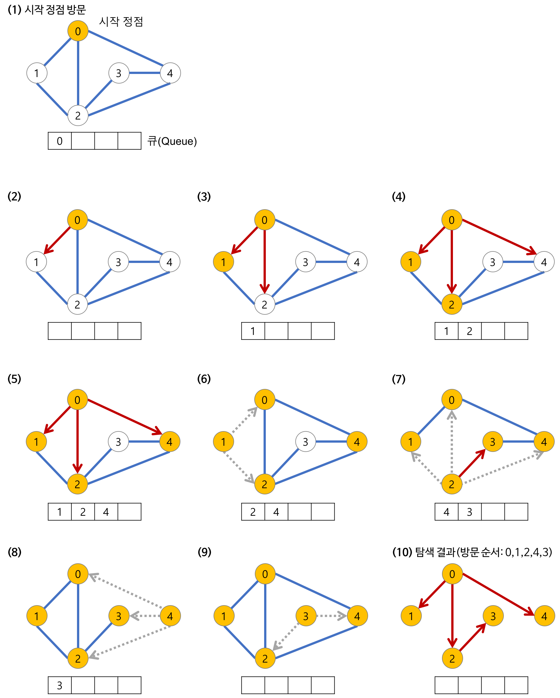

## Today I Learned

### **BFS (Breadth-First Search)**

<br>

> **그래프 탐색이란**

- 하나의 정점으로부터 시작하여 차례대로 모든 정점들을 한 번씩 방문하는 것
- Ex) 특정 도시에서 다른 도시로 갈 수 있는지 없는지, 전자 회로에서 특정 단자와 단자가 서로 연결되어 있는지

<br>

> **너비 우선 탐색(BFS)**

루트 노드에서 시작해 **인접한 노드를 먼저 탐색**하는 방법

- 시작 정점으로부터 가까운 정점을 먼저 방문하고 멀리 떨어져 있는 정점을 나중에 방문하는 순회 방법이다.
- 즉, 깊게(Deep) 탐색하기 전에 넓게(Wide) 탐색하는 것이다.
- 사용하는 경우 : **두 노드 사이의 최단 경로** 혹은 **임의의 경로를 찾고 싶을 때** 이 방법을 선택한다.
    - 지구상에 존재하는 모든 친구 관계를 그래프로 표현한 후 Ash와 Vanessa 사이에 존재하는 경로를 찾는 경우
    - 깊이 우선 탐색의 경우 - 모든 친구 관계를 다 살펴봐야 할지도 모른다.
    - 너비 우선 탐색의 경우 - Ash와 가까운 관계부터 탐색
- 너비 우선 탐색(BFS)이 깊이 우선 탐색(DFS) 보다 좀 더 복잡하다.

<br>

> **너비 우선 탐색(BFS)의 특징**

- 직관적이지 않은 면이 있다.
    - BFS는 시작 노드에서 시작해 거리에 따라 단계별로 탐색한다고 볼 수 있다.
- BFS는 **재귀적으로 동작하지 않는다.**
- 이 알고리즘을 구현할 때 가장 큰 차이점은, 그래프 탐색의 경우 **어떤 노드를 방문했었는지 여부를 반드시 검사해야 한다.**
    - 이를 검사하지 않을 경우 무한 루프에 빠질 위험이 있다.
- BFS는 방문한 노드들을 차례로 저장한 후 꺼낼 수 있는 자료 구조인 **큐(Queue)를 사용**한다.
    - 즉, 선입선출(FIFO) 원칙으로 탐색
    - 일반적으로 큐를 이용해서 반복적 형태로 구현하는 것이 가장 잘 동작한다.

<br>

> **깊이 우선 탐색(DFS)의 과정**



> **깊이 우선 탐색(DFS) 코드 예제**
```cpp
void search(Node root) {
  Queue queue = new Queue();
  root.marked = true; // (방문한 노드 체크)
  queue.enqueue(root); // 1-1. 큐의 끝에 추가

  // 3. 큐가 소진될 때까지 계속한다.
  while (!queue.isEmpty()) {
    Node r = queue.dequeue(); // 큐의 앞에서 노드 추출
    visit(r); // 2-1. 큐에서 추출한 노드 방문
    // 2-2. 큐에서 꺼낸 노드와 인접한 노드들을 모두 차례로 방문한다.
    foreach (Node n in r.adjacent) {
      if (n.marked == false) {
        n.marked = true; // (방문한 노드 체크)
        queue.enqueue(n); // 2-3. 큐의 끝에 추가
      }
    }
  }
}
```