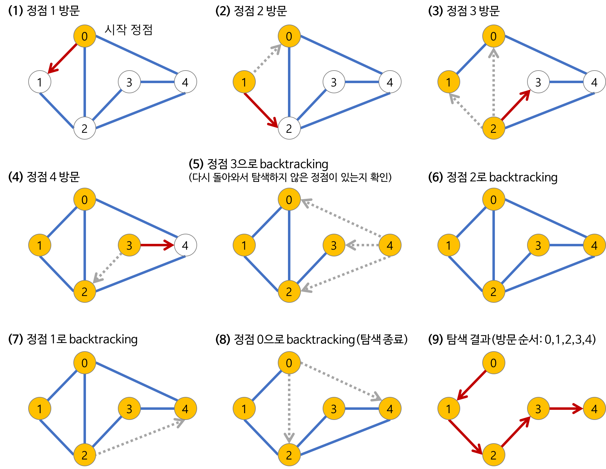

## Today I Learned

### **DFS (Deep-First Search)**

<br>

> **그래프 탐색이란**
- 하나의 정점으로부터 시작하여 차례대로 모든 정점들을 한 번씩 방문하는 것
- Ex) 특정 도시에서 다른 도시로 갈 수 있는지 없는지, 전자 회로에서 특정 단자와 단자가 서로 연결되어 있는지

<br>

> **깊이 우선 탐색(DFS)**

루트 노드에서 시작해서 다음 분기로 넘어가기 전에 **해당 분기를 완벽하게 탐색하는 방법 (끝까지 탐색)**

- 미로를 탐색할 때 한 방향으로 갈 수 있을 때까지 계속 가다가 갈 수 없게 되면 다시 가장 가까운 갈림길로 돌아와서 다른 방향으로 다시 탐색하는 방법과 유사하다.
- 즉 넓게(Wide) 탐색하기 전에 깊게(Deep) 탐색하는 것이다.
- 사용하는 경우 : **모든 노드를 방문**하고자 하는 경우에 이 방법을 선택
- 단순 검색 속도 자체는 너비 우선 탐색(BFS)에 비해서 느리다.

<br>

> **깊이 우선 탐색(DFS)의 특징**

- 자기 자신을 호출하는 **순환 알고리즘 형태**를 가지고 있다.
- 전위 순회를 포함한 다른 형태의 트리 순회는 모두 DFS의 한 종류이다.
- 이 알고리즘을 구현할 때 가장 큰 차이점은, 그래프 탐색의 경우 **어떤 노드를 방문했었는지 여부를 반드시 검사해야 한다**는 것이다.
    - 이를 검사하지 않을 경우 무한 루프에 빠질 위험이 있다.
- 후입 선출 구조로 자료 구조 Stack을 활용하기도 한다.

<br>

> **깊이 우선 탐색(DFS)의 과정**




> **깊이 우선 탐색(DFS) 코드 예제 (프로그래머스 Lv.2 타겟 넘버)**

```csharp
using System;

public class Solution 
{
    int count = 0;
    public int solution(int[] numbers, int target) 
    {
        DFS(numbers, target, -1);
        return count;
    }
    
    private void DFS(int[] numbers, int target, int index)
    {
        index++;
        if(numbers.Length == index)
        {
            int total = 0;
            foreach(int num in numbers)
            {
                total += num;
            }
            if(total == target) count++;
            return;
        }
        DFS(numbers, target, index);
        numbers[index] *= -1;
        DFS(numbers, target, index);
    }
}
```