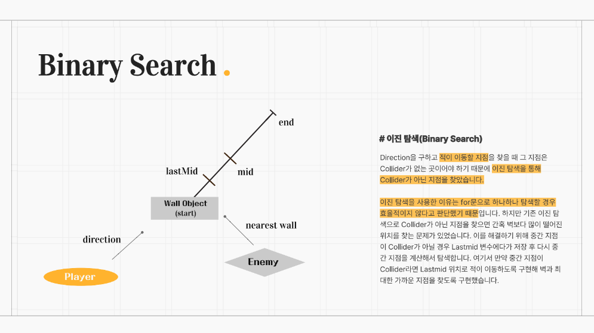

## Today I Learned

### **Binary Search**

 

> **이진 탐색의 개념 및 구현**

이진 탐색은 정렬된 리스트에서 검색 범위를 줄여 나가면서 검색 값을 찾는 알고리즘입니다.

이진 탐색은 정렬된 리스트에만 사용할 수 있다는 단점이 있지만, 검색이 반복될 때마다 검색 범위가 절반으로 줄기 때문에 속도가 빠르다는 장점이 있습니다. O(log n)

 

> **동작 방식**

이진 탐색 알고리즘은 리스트의 중간 값과 비교하여 검색값을 찾습니다. 중간 값을 찾아야 하기 때문에 반드시 정렬된 배열에서만 사용할 수 있습니다.

이진 탐색의 동작 방식은 다음과 같습니다.

1. 배열의 중간 값을 가져옵니다.
2. 중간 값보다 검색 값이 크다면 중간값 기준 배열의 오른쪽 구간을 대상으로 탐색
3. 중간 값보다 검색 값이 작다면 중간값 기준 배열의 왼쪽 구간을 대상으로 탐색
4. 값을 찾거나 간격이 비어있을 때까지 반복합니다.

 

> **Battle Island에서 Binary Search**

1. Enemy 유닛은 자신의 위치에서 가장 가까운 벽 오브젝트 Wall를 찾습니다.
2. Player → Wall을 향하는 방향을 구합니다.
3. Wall Position을 기준을 Start, Start로부터 구한 방향으로 n 이동한 지점을 End라고 구합니다.
4. Start와 End 지점의 사이를 구해 그 지점을 Mid로 지정합니다. (Start + End) / 2 = Mid // LastMid 지점을 과거 Mid 지점입니다.
5. Mid 지점에 Wall Object Collider가 감지가 된다면 Mid는 Start가 되고 다시 Mid를 구합니다.
6. Mid 지점에 Wall Object Collider가 감지가 되지 않는다면 LastMid는 Mid가 되고 Mid는 End가 되고 Mid를 다시 구합니다.
7. 과정 반복
8. Mid 지점에 Wall Object Collider가 감지가 됐을 때 LastMid는 감지가 안됐다면 LastMid 지역은 Wall Object에서 가장 가까운 위치이기 때문에 해당 위치를 Result Position으로 설정합니다.
