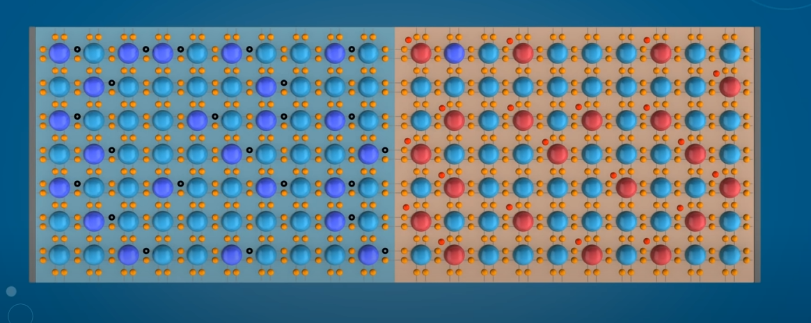
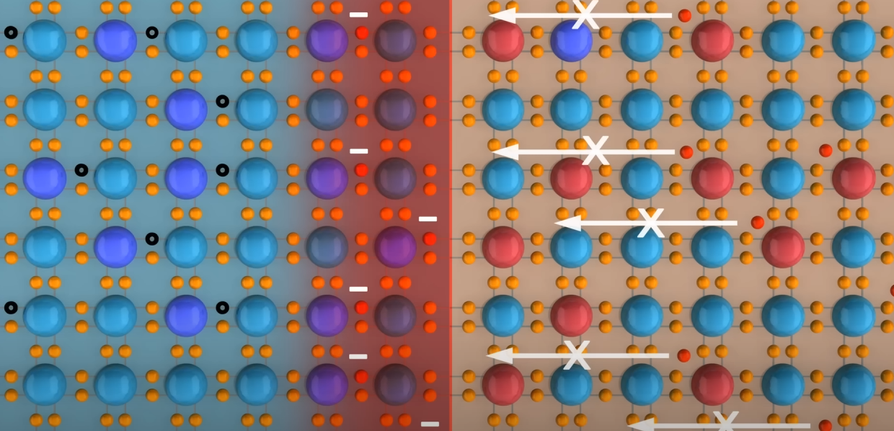
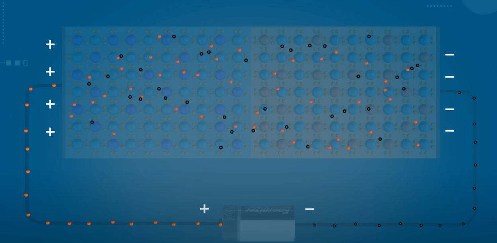
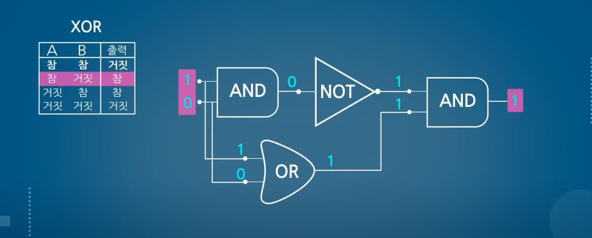

> ## CPU 작동 원리

[\[CPU는 어떻게 작동할까? (Youtube: bRd 3D)\]](https://www.youtube.com/watch?v=Fg00LN30Ezg "https://www.youtube.com/watch?v=Fg00LN30Ezg")  

##  

# CPU는 어떻게 작동할까?

CPU는 `트랜지스터`라는 반도체로 만들어졌다. CPU를 알기 위해서는 먼저 트랜지스터가 어떻게 작동하는지 알아야할 필요가 있다.

 

## 트랜지스터 (Transistor)

반도체는 주로 실리콘으로 만들어진다. 실리콘은 최 외각전자가 4개로 다른 실리콘 원자들과 전자를 공유하며 단단하게 결합하고 있다. 원자는 최 외각 전자가 8개일 때 가장 안정한 구조를 이루는데 이렇게 단단하게 결합되어 있으면 전자가 이동하지 않아 전류가 흐르지 않는다. 이처럼 순수한 실리콘은 전류가 흐르기 어렵다.

 

 

실리콘보다 전자가 한 개 많거나 적은 원소를 첨가해 전류를 통하게 만들어준다. 전자가 하나 부족한 원소를 넣으면 빈 구멍이 생기는데 이 곳으로 전자가 이동할 수 있게 된다. 전자가 왼쪽으로 이동할 시 전류는 반대쪽인 왼쪽으로 흐른다. 해당 구멍은 마치 양전하를 가진 입자처럼 행동하는데 이를 **\[양공\]**이라고 불립니다. 

 

 

실리콘에 전자가 한 개 많은 원소를 첨가하면 남는 전자가 자유롭게 이동하며 전류를 흐르게 해준다.

 

 

전자가 한개 적은 원소를 첨가한 반도체는 Positive(양성)의 P를 따서 `P형 반도체`라고 부르고 전자가 한 개 적은 반도체는 Negative(음성)의 N을 따서 `N형 반도체`라고 부른다.

 

 

P형 반도체와 N형 반도체를 서로 붙여본다면?

 

- P형 반도체에는 양전하를 띈 양공이 있다.
- N형 반도체에는 자유 전자가 있다.

 

이 두 반도체가 연결된 경계면을 보면 자유 전자들은 양공에 이끌려 결합하게 된다.

 

중성 상태에 있던 원자가 전자를 하나 받게 되면 음전하를 띄게 된다. 반대로 중성 상태에 있던 원자가 전자를 하나 빼앗기면 양전하를 띄게 된다.

 

 

 

다음과 같이 음전하를 띄게 된 원자의 반발력으로 더 이상 전자들이 넘어오지 못하고 양전하를 띄게 된 원자의 반발력으로 양공이 이동하지 못하게 된다. 이렇게 **더 이상 이동 가능한 전하들이 없어지게 되는데 이 곳을 \[공핍 영역\]**이라 한다.

 

 

 

이렇게 공핍 영역 가장자리에 서로 다른 전하를 가진 면이 생기게 되고 +에서 -쪽으로 전기장이 생성된다.

 

 

 

이 상황에서 전지를 이미지와 같이 연결하면 좌측이 음극이 우측이 양극이 된다. 양전하를 띈 양공은 -쪽으로 음전하를 띈 자유 전자는 +쪽으로 끌려오게 되고 공핍 영역은 더욱 확대된다.

 

 

반대로 전지를 연결하면 반대되는 극에 이끌리는 특성으로 이미지와 같이 이동하게 된다. 공핍 영역에서 전자의 이동이 막히지만 인공적으로 가해지는 전압이 세면 이 힘을 무시하고 넘어갈 수 있게 되어 전류가 흐르게 된다. 이처럼 전류가 흐르게 하려면 같은 전하를 가진 전압을 연결하면 되는데 이를 순방향이라고 하며 반대는 역방향이라고 한다.

 

 

p-n-p 반도체를 이미지와 같이 연결하고 한 쪽에는 순방향 한 쪽에는 역방향으로 전지를 연결했다고 가정한다면 좌측에 p-n 반도체에는 전류가 흐르지만 반대 n-p에서는 전류가 흐르지 않을 것이다.

 

 

하지만 순방향 전지에 힘을 더욱 강하게 한다면 n 반도체를 넘어가는 전자가 생겨 전류가 흐르게 된다. 이처럼 `전류가 흐르게 할 수도 흐르지 않게 할 수도 있는데 이런 방식으로 스위치 작용을 해주는 반도체를 [트랜지스터]`라고 한다.

 

 

역방향의 전압을 높여주면 흐르는 전류의 양도 많아진다.

 

 

반도체는 이미지와 같이 생겼으며 pnp, npn 반도체가 들어있다. 가운데 도선에 특정 전압을 걸어주면 전류가 흐르게 되는 원리이다.

 

## **로직 게이트(Logic Gate)**

 

트랜지스터를 이용하면 로직 게이트라고 불리는 논리회로를 만들 수 있다.

 

### AND GATE

 

 

컴퓨터는 0과 1로 이루어진 디지털 신호를 인식하는데 전류가 통하면 1 통하지 않으면 0이 된다. 이는 참과 거짓으로 표현하기 한다. 이미지와 같이 A, B 모두 참일 때 참인 되는 논리 게이트를 

AND Gate 라고 한다.

 

### **OR GATE**

 

둘 중 하나면 전압이 걸려도 전압이 흐르게 되는 경우 1을 출력하는 논리 게이트를 OR Gate라고 한다.

 

 

### NOT GATE

NOT Gate는 참인 경우 거짓으로 거짓인 경우 참을 출력하는 논리 게이트로 출력되는 장소를 앞으로 옮기면 이미지와 같은 모양을 띄게 된다. 이 경우 전압이 걸리면 출력에 전류가 흐르지 않고 전압이 없다면 출력에 전류가 흐르게 되어 NOT Gate 논리가 완성된다.

 

 

### XOR GATE

해당 논리 회로를 통해 AB가 다를 때 참을 출력하는 XOR 게이트를 완성할 수도 있다.

 

 

 

이미지처럼 논리 게이트를 통해 연산도 가능하다.

 

CPU에는 ALU라는 논리 장치가 존재하는데 AND, OR, NOT 논리를 연산하는 역할을 한다. 앞에서 보았던 논리 게이트를 활용해서 산술 논리 장치(ALU)를 만들게 된다.

 

 

 

## **메모리적 관점**

하드 디스크와 RAM, CPU가 있다. 하지만 CPU의 속도에 비해 하드는 너무 느리기 때문에 CPU는 RAM과 소통한다. 우리는 어떤 프로그램을 실행하면 그 데이터는 RAM으로 이동하고 CPU는 그 데이터를 가져온다. 

 

하지만 RAM 또한 CPU에 비해서는 많이 느리기 때문에 CPU 내부나 근처에 캐시 메모리를 만들어 그곳에 데이터를 저장해 사용한다. 하지만 캐시 메모리는 RAM에 비하면 용량이 작기 때문에 중요하다고 판단되는 데이터만 저장해서 사용한다.

 

캐시 메모리는 Level 1 ~ 3까지 단계를 나누어 사용한다. Level 1 캐시는 CPU가 가장 먼저 접근하는 메모리로 속도가 가장 빠르지만 용량이 적다. 반대로 Level 3는 용량이 큰 대신에 속도가 가장 느리다.

 

 

CPU는 데이터를 요청할 때 L1 CACHE → L2 CACHE → L3 CACHE → RAM 순서로 데이터를 요청한다.

 

 

 

### **기억장치**

 

컴퓨터에 있는 기억 장치는 SSD, RAM, CACHE, REGISTER가 있다.

 

 

> 레지스터 (REGISTER)

 

 

레지스터는 CPU 내부에서 데이터를 일시적으로 저장하는 장치로 속도가 가장 빠른 메모리이다.

 

### 속도 순서

아래로 갈수록 속도는 빠르지만 요량이 작고 가격도 비싸진다.

 

레지스터는 CPU가 어떻게 작동하는 지 알아보기 위해서 꼭 알아야 하는 장치이다. 그 종류가 매우 많지만 그 몇 가지만 알아본다면 다음과 같다.

 

 

#### Program Counter

먼저 Program Counter라고 불리는 레지스터가 있다.

 

 

예시 : 2+3의 값은 12번지에 저장한다.

 

1. 프로그램 카운터에 가져와야 할 메모리 주소가 존재한다.
2. 이 주소는 메모리 주소 레지스터로 전달된다.
3. 메모리 주소 레지스터는 해당 주소에 데이터를 가져와 메모리 버퍼 레지스터에 저장한다. (인출)
4. 예시로 LOAD 10은 데이터를 가져오라는 명령어이기 때문에 명령어 레지스터로 이동한다.
5. 이후 프로그램 카운터에 1이 오른다. 16비트는 2까지 32비트 프로세서는 메모리 4칸을 한 번에 처리 가능하다.
6. 명령어 레지스터에 저장된 명령은 제어장치로 이동되어 해석된다. (해석)
7. LOAD 10은 10번지 데이터를 읽어오라는 명령이기 때문에 메모리 주소 레지스터에 10이 입력된다.
8. 그럼 메모리 버퍼 레지스터에 2가 읽어진다. (인출)
9. 누산기에 2가 저장된다.
10. 이후 똑같은 형식으로 101번지 102번지 명령어를 실행한다.
11. 계산은 ALU에서 처리된다. (실행)
12. 이후 12번지에 값을 저장한다. (저장)

 

 

 

CPU는 인출 → 해석 → 실행 → 저장의 과정을 거친다. 

 

실제로 CPU는 이 단계들 조차 세분화해서 사용한다.  이렇게 분리된 각각의 프로세스를 **스레드(Thread)**라고 한다. 

코어 하나에 여러 개의 스레드가 실행되면 속도가 빨라지게 된다. 코어가 많아지면 당연히 속도가 빨라진다.

이러한 프로세서의 구조는 회사마다 다르다. 프로세서의 구조를 **아키텍처**라고 한다.

 