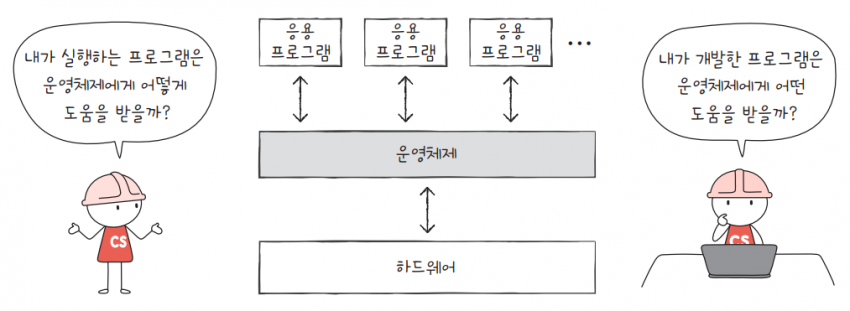
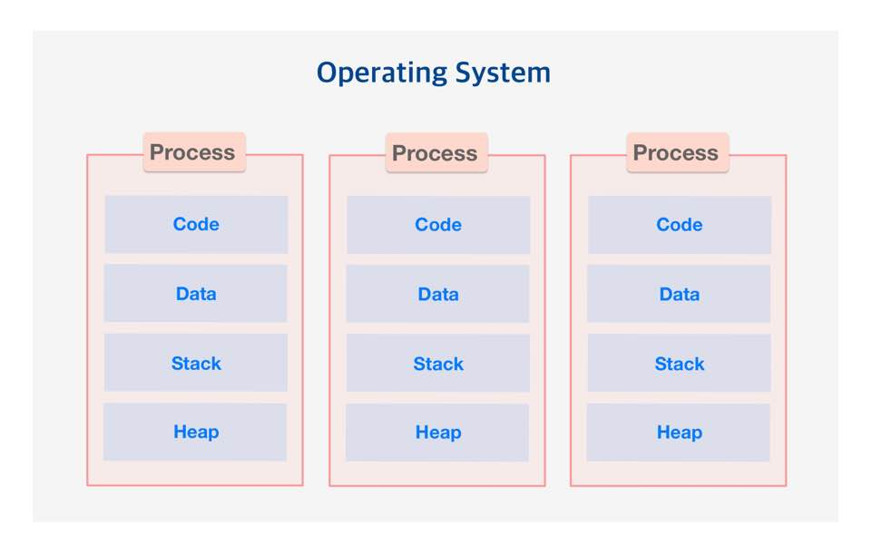
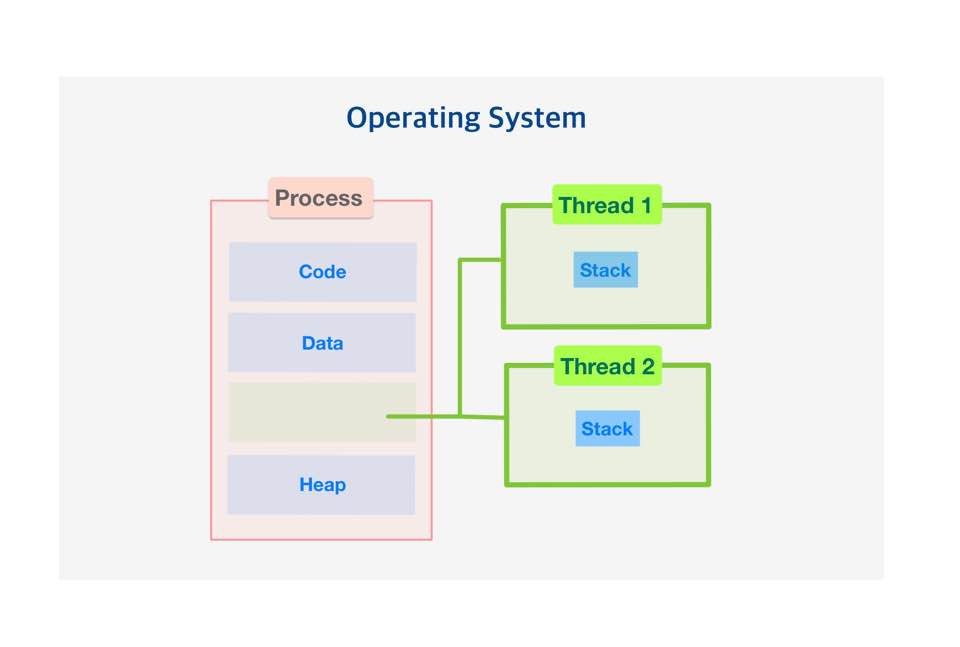

## Today I Learned

### **운영체제**

> **Process, Program, Thread에 대하여**  

  
- **운영체제(OS)**

운영체제(OS, Operating System)는 컴퓨터의 핵심 소프트웨어로, 컴퓨터 하드웨어와 응용 프로그램 간 상호작용을 관리하고 제어하는 역할을 합니다.

  

운영체제의 목적은 사용자와 하드웨어 사이의 인터페이스를 제공해 **효율적으로 응용 프로그램이 동작하도록 지원**하고, **시스템 자원을 효율적으로 관리하여 응용 프로그램이 원활하게 동작**할 수 있도록 합니다.

  

  

- **운영체제 종류**

1. **윈도우(Window)** : Microsoft 사에서 개발한 운영체제로, 노트북 및 서버 시스템에서 주로 사용합니다.
2. **mac OS** : Apple 사에서 개발한 운영체제로 mac 컴퓨터 및 노트북에서 사용합니다. 시스템 안정성과 편의성 중점으로 둔 운영체제입니다.
3. **리눅스(Linux)** : 오픈 소스 운영체제로, 다양한 배포판이 있습니다. 서버 시스템 및 임베디드 시스템에서 주로 사용되며, 안정성과 보안성이 높은 운영체제입니다. 
4. **유닉스(UNIX)** : 다중 사용자 및 다중 작업을 지원하는 운영체제로, 서버 환경에서 주로 사용되며 안정성과 신뢰성이 높습니다.

    

- **Program**

Program은 간단하게 \[실행 가능한 파일\]입니다. 즉 개발자가 작성한 코드를 컴파일 과정을 통해 사용자가 실행시킬 수 있도록 만들어진 실행 파일입니다. 흔히 .exe 파일을 실행 파일. Program이라고 합니다. 

    

- **Process**

Process는 \[실행 중인 Program\]입니다. 실행 파일인 Program은 사용자가 실행하기 전까지는 아무런 동작을 하고 있지 않습니다. 하지만 사용자가 Program을 실행하는 순간 운영체제가 메모리 등의 필요한 자원을 할당해 준 실행 중인 Program, 즉 Process가 됩니다.

Process는 각각 Code, Data, Stack, Heap의 구조로 되어있는 독립된 메모리 영역을 할당받습니다. 다른 Process 자원에 접근하려면 프로세스 간의 통신(IPC)을 사용해야 합니다. 또한 최소 하나 이상의 Thread를 포함합니다. 

과거에는 컴퓨터가 한 번에 하나의 동작밖에 수행하지 못했지만 현재는 멀티태스킹 기능이 나오면서 컴퓨터가 Process 여러 개를 동시에 돌리는 것이 가능해졌습니다. 여러 Process를 한 번에 돌리는 작업은 동시적, 병렬적, 또는 이 둘의 혼합으로 이루어집니다.

    

- **동시성(Concurrency)**

프로세서는 원래 한 번의 하나의 프로세스만 실행시킬 수 있습니다. 동시성은 프로세서 하나가 프로그램 여러 개를 돌아가며 일부분씩 수행하는 방식입니다. 이렇게 진행 중인 작업을 바꾸는 것을 \[Context Switching\]이라고 하며 이 과정이 매우 빠를 시 동시에 진행하는 것처럼 보입니다.

   
  

- **병렬성(Parallelism)**

병렬성은 프로세스 하나에 코어 여러 개가 달려서 각각 동시에 작업을 하는 방식입니다. 듀얼코어, 쿼드코어, 옥타코어와 같은 명칭의 프로세서가 달린 컴퓨터에서 할 수 있는 방식입니다.

  

하나의 Process 안에서도 여러 가지 작업들이 동시에 진행되는 경우 이에 인해 생기는 갈래들을 \[Thread\]라고 부릅니다.

   

- **Thread**

Thread는 Process 내에서 Process의 자원을 이용해서 실제로 작업을 수행하는 일꾼 개념입니다. 프로세스의 실행 단위로 Process는 최소 한 개 이상의 Thread를 가지며 이를 Main Thread라고 합니다.

  

Thread는 독자적인 Stack 메모리를 갖고 나머지 메모리 영역은 공유합니다. 각각의 Thread는 Stack을 제외한 각자 메모리는 공유하기 때문에 서로 상호작용이 용이합니다. 하지만 동기화, 데드락 등의 문제가 발생할 수 있습니다.

  

