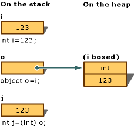
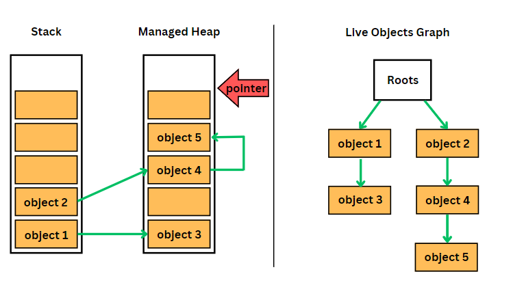
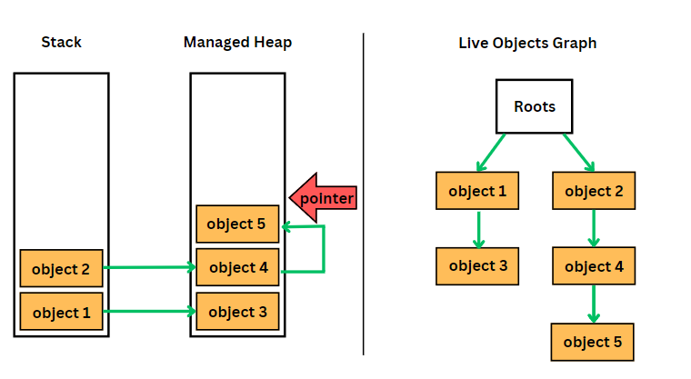

## Today I Learned

### **가비지 컬렉터란?**

참고자료

1) [C# - 가비지 컬렉션 (Garbage Collection, GC)](https://velog.io/@dohui/C-%EA%B0%80%EB%B9%84%EC%A7%80-%EC%BD%9C%EB%A0%89%ED%84%B0)

  

> ### **Garbage Collection이란?**

  

스택 메모리는 함수가 실행되는 순간부터 종료까지 얼만큼 공간을 사용하는지 계속 추적된다. 스택 영역은 알아서 줄어들고 늘어나기 때문에 따로 신경 쓸 필요가 없다.

  

하지만 힙 영역의 경우 메모리를 할당하고 어떤 행동도 하지 않으면 계속 메모리에 올라온 상태로 유지가 된다. C와 C++의 경우 프로그래머가 직접 메모리를 코드 상에서 관리해야 하지만 **C#은 CLR이 자동적으로 메모리를 관리**해준다. **Garbage Collection은 이러한 자동 메모리 관리의 중심이 되는 기능**이다. 그리고 이 **Garbage Collection을 담당하는 역할을 하고 있는 것을 Garbage Collector**라고 한다.

  
<br>
  

> **Garbage란 무엇일까?**

  

Reference Type 변수들을 살펴보면 **스택 메모리에 주소 값을 담아두고 힙 메모리에 접근하는 방식으로 저장**되어 있다. 여기서 함수가 종료되고 지역 변수들이 제거되면서 스택 메모리에서 힙 메모리를 가리키고 있는 일부 주소값들이 같이 Pop된다. 그러면 해당 주소값에 있는 힙 메모리의 데이터에는 더 이상 접근할 수 없는 상태가 된다. 이렇게 **참조할 수 없게 된 객체들을 Garbage**라고 부른다.

  

마이크로소프트 공식 문서에서 박싱과 언박싱을 설명할 때 사용하는 그림을 살펴보자.

  

```csharp
void static Main()
{
	int i = 123;      // a value type
	object o = i;     // boxing
	int j = (int)o;   // unboxing
}
```

  

여기서 Main 함수가 끝나게 되면 o는 Stack 메모리에서 Pop된다. 그럼 이것이 가리키는 Boxing된 i는 힙 메모리에서 Garbage로 남아있게 되는 것이다.

  



  

  

> **우리는 왜 Garbage Collection을 알아야 하는가?**

  

Garbage Collector 역시 리소스를 사용하는 소프트웨어이다. 즉, 프로그램에서 사용하는 자원을 함께 사용하고 있다는 점을 명심해야 한다. 유한한 자원 안에서 Garbage Collector가 사용하고 있는 부분을 최소화 할 수 있다면 우리 프로그램의 성능이 더 늘 수 있다. 이것이 바로 Garbage Collector가 어떻게 동작하는 지 이해해야 하는 이유이며 이를 바탕으로어떻게 코드를 작성해나갈지 고민해봐야 한다.

  
<br>
  

> **Managed Heap (관리되는 힙)**

  

힙 메모리는 프로세스 별로 고유하게 가진다. 새 프로세스가 생성될 때 인접한 공간의 메모리를 할당받게 되는데 이를 Managed Heap이라 부른다.

  <br>

- 동작 방식

Managed Heap은 포인터로 힙 메모리에 할당된 object의 위치를 가리킨다. 런타임에서 개체를 메모리에 할당할 때 스택과 유사하게 포인터에 값을 더하는 식으로 진행되기 때문에 메모리 할당 측면에서 스택만큼 효율적이다.

  

이 Managed Heap의 경우 효율성을 위해 **공간을 3개로 나눈다.**

  

- 왜 공간을 3개로 나눌까?

Grabage Collection이 필요한 순간 실질적으로 오래 사용되는 개체가 있고 잠깐 사용되는 개체가 있다. 오래 사용되는 개체의 경우 메모리가 찼을 때 굳이 계속 봐야 하는가에 대해 고민해봐야 한다. 이를 고려하지 않고 전체를 도는 것은 상당히 부담되는 일이다.  그래서 **개체가 얼마나 오래 살아남았느냐를 기준으로 해당 개체를 보는 빈도수를 구분하기 위해 ‘세대’라는 개념을 도입**한다.

 <br> 

> **Garbage Collection Generation (세대**)

  

Generation (세대)는 몇 번의 Garbage Collection을 거쳤는지 나타낸다. **Garbage Collection이 일어나고 Stack 메모리에 아직 참조되고 있는 Object들에 대해서는 세대 수를 증가**시킨다. \[**여러 번 거쳤을 때 남아있다면 프로그램에서 계속해서 사용되고 있는 것이라고 볼 수 있기 때문에 이 Object들은 매번 Garbage Collector가 확인할 필요가 없다는 것을 의미\]**한다.

  

구체적으로 어떻게 처리되는지 살펴보자. 먼저 새로 힙 메모리에 할당되는 Object의 경우 0세대에 저장한다. 이후 0세대가 꽉차게 되면 Garbage Collection이 일어나고 사용이 되고 있는 Object들은 1세대에 저장된다. 동일한 과정으로 1세대에 대해 Garbage Collection이 일어날 때 살아남은 Object들은 2세대에 저장된다. 2세대로 옮겨진 Object들은 더 이상 다른 곳으로 옮겨가지 않는다. 만약 2세대도 꽉차서 Garbage Collection이 수행된다면 Garbage Collector는 모든 세대에 대해 Garbage Collection을 진행한다. 이것을 Full GC라고 부르는데 이때 일정 시간 프로그램을 멈추고 Garbage Collection을 하기 때문에 Garbage를 잘 관리할 필요가 있다.

  

  <br>

> **Garbage Collection 과정**

  

- Garbage Collection은 어떤 과정으로 진행될까?

크게 3가지 과정을 거치는데 간단히 정리하면 다음과 같다.

  

1. 사용되고 있는 개체들을 연결하는 작업 (Mark) 
2. 사용되지 않는 개체들을 식별하는 작업 (Relocate)
3. 필요 없는 객체들을 지우고 살아있는 객체들을 모으는 작업 (Compact)

  

  <br>

> **1) Marking 단계 (표시 단계)**

  

Garbage Collection 주기가 시작될 때 Garbage Collector는 일단 모든 Object를 Garbage로 가정한다. 즉, 루트 목록 내 어떤 루트도 메모리를 가리키고 있지 않다고 가정한다. 이 상태에서 Garbage Collecor는 루트 목록을 돌면서 각 루트가 참조하는 것들을 마킹한다. 좀 더 면밀히 말하면 마킹이란 루트 목록에서 시작되는 연결된 그래프를 만드는 것이다.

  

  

### 루트 목록이란?

루트 목록에는 스택, 가비지 수집 핸들, 정적 데이터 등으로 구성된다.

  

이걸 General하게 표현한 그림이다. Stack 메모리에서 참조하고 있는 Heap Object들과 그 Object들이 참조하고 있는 다른 Object들 등 루트 목록에서 도달할 수 있는 Object들에 대해 그래프를 만든다.

  

 

  
<br>
  

> **2) Relocation 단계 (재배치 단계)**

  

루트 목록에서 도달할 수 없는 Object들을 Garbage로 간주한다. Garbage가 차지한 공간은 비어있는 공간으로 간주하게 된다.

  

  <br>

> **3) Compaction 단계 (압축 단계)**

 <br> 

루트 목록에 대한 조사가 끝나면 Garbage Collector는 Heap을 순회하며 Garbage가 차지했던 비어있는 공간에 인접한 도달할 수 있는 Object들을 메모리에 복사를 통해 덮어 씌운다. 도달 가능한 모든 Object에 대한 이동이 끝나면 Garbage Collector는 포인터의 위치 또한 적절하게 수정한다.(Application root, Managed Heap Pointer)

  

최종적으로 다음과 같이 깨끗한 상태의 메모리를 얻게 되고 이것이 Garbage Collection의 한 주기에 대한 과정이다.

  

 

  

- [[메모리 단편화]]

메모리 할당과 해제가 반복적으로 일어나면 Haep에 듬성듬성 메모리가 배치되어 메모리 단편화가 발생하고 이는 할당 속도를 느리게 하는 원인이 된다. Garbage Collection의 Compacting 과정에서 비어 있는 공간에 Object를 당겨와 차곡차곡 쌓기에 메모리 공간 낭비 없이 사용할 수 있게되므로 메모리 단편화를 해결해준다.

  
<br>
  

> **The Largest Object Heap (대형 개체 힙)**

  

여태까지 살펴본 Managed Heap은 소형 개체 힙을 가리킨다. Garbage Collection은 큰 개체에 대한 할당을 담당하는 Largest Object Heap (대형 개체 힙)을 따로 가지고 있다. 여기서 큰 개체의 경우 85KB 이상의 개체를 가리킨다.

  

왜 대형 개체 힙을 가지는 것이 맞는건지는 앞서 어떤 과정으로 Garbage Collection이 이루어졌는지를 이해하면 알 수 있다. 대형 개체의 경우 잡아먹는 공간 자체가 크기 때문에 더 빨리 메모리를 가득 채우게 될 것이고 이는 Garbage Collection을 훨씬 빈번하게 일으키게 된다. 따라서 [.Net](https://.Net "https://.Net")에서는 이러한 대형 개체들을 대형 개체 힙에 관리한다. 

  

- 대형 개체 힙의 동작 방식

대형 개체 힙은 동작 방식이 소형 개체 힙과는 다르다. 대형 개체 힙은 포인터로 메모리들을 복사하는 방식처럼 동작하기에는 개체 복사 자체에서 발생하는 비용이 너무 크다. 따라서 대형 개체 힙은 object의 크기를 계산한 뒤 힙에 여유 공간이 있는 지 탐색하여 할당하게 된다.

  

Garbage Collection이 일어난 후 대형 개체 힙에서는 해제된 공간을 그대로 둔다. 메모리 복사를 통해 Object를 압축하는 과정의 비용이 크기 때문이다. 그래서 위에서 설명한 메모리 단편화 문제가 발생하게 된다. 또한 CLR에서는 대형 개체 힙을 2세대 힙으로 간주하기 때문에 대형 개체 힙의 Garbage Collection을 하려면 Full GC가 일어나야 한다.

_ps. 그래서 큰 Object 할당은 늘 신중히 또 신중히 한다._

 <br> 

> **Garbage Collection을 줄이기 위한 노력**

  

- 객체를 너무 많이 할당하지 않는다.
    - 너무 많은 Object를 생성하면 그만큼 메모리가 금방 차고 Garbage Collection이 빈번히 발생하게 될 것이다. 따라서 필요 이상으로 많이 만들지 않는다.

  

- 너무 큰 객체를 할당하지 않는다.
    - 대형 개체 힙에 대해 이해했으면 자연스레 깨닫게 되는 내용이다.

  

- 복잡한 참조 관계 만들지 않는다.
    - Garbage Collector는 Garbage Collection 후 도달할 수 있는 Object의 세대를 옮기기 위해 메모리 복사를 수행한다. 이때 참조 관계가 복잡하다면 단순히 메모리 복사가 아니라 참조하고 있는 모든 메모리 주소를 수정하는 과정을 거쳐야 한다. 또한 2세대 메모리에 있는 개체가 0세대 메모리를 참조하게 되는 경우를 보자. root에서 해당 0세대 메모리 object를 참조하고 있지 않음에도 2세대 메모리가 참조를 하고 있기 때문에 Garbage Collection 과정에서 CLR은 쓰기 장벽(Write Barrier)을 통해 root에서 도달할 수 있는 것처럼 동작하게 해준다. 이 쓰기 장벽도 비용이 큰 편이라 참조 관계는 복작하지 않게 만드는게 Garbage Collection 비용을 많이 줄여준다.

  

- 루트를 많이 만들지 않는다.
    - 루트 목록을 기반으로 Garbage를 찾아내기 때문에 많지 않다면 그만큼 루트 목록을 순회하는 시간을 줄일 수 있다.