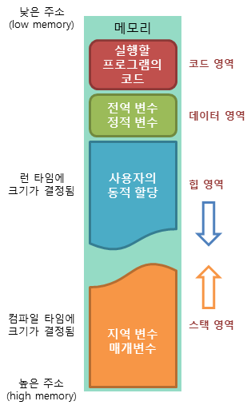

## Today I Learned

### **메모리 영역**

- 메모리는 크게 스택, 힙, 데이터 영역, 코드 영역으로 나뉩니다.

1. 스택(Stack)은 프로그램이 자동으로 사용하는 임시 메모리 영역입니다. 함수 호출 시 생성되는 지역 변수와 매개 변수가 저장되는 영역이고, 함수 호출이 완료되면 사라집니다. 이때 가장 마지막에 호출된 함수가 가장 먼저 종료되는 후입선출의 방식입니다.  컴파일로 크기 정해짐 

2. 힙(heap)은 프로그래머가 직접 공간을 할당, 해제하는 동적 메모리 공간입니다. 힙은 스택과 달리 크기가 제한되지 않으며, 프로그램 실행 중에 계속해서 메모리를 할당하거나 해제할 수 있습니다.
=> 런타임에 정해짐

3. 데이터 영역은 전역 변수와 정적 변수를 저장합니다. 이 영역에 저장된 변수는 프로그램이 시작될 때 메모리에 할당, 종료될 때까지 유지됩니다.
 
4. 코드 영역은 프로그램 코드를 저장합니다. 읽기 전용으로 되어 있으며 실행 중에 코드를 수정할 수 없습니다.
이렇게 나뉘어진 메모리 구조는 컴퓨터가 프로그램을 실행할 때 메모리를 효율적으로 관리하고, 안정성과 보안을 유지할 수 있도록 합니다.

  

