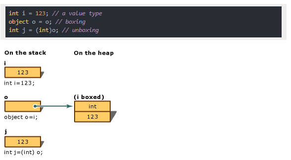

## Today I Learned

### **박싱과 언박싱**

- **Boxing**

박싱(Boxing)은 값 형식의 데이터를 참조 형식으로 변환하는 것을 말합니다. 
  

ex) int → object

  

 

- **Unboxing**

언박싱(Unboxing)은 반대로 참조 형식의 데이터를 값 형식으로 변환하는 것을 말합니다.int형 변수는 값 형식의 데이터이며, object 타입의 변수 obj에 할당될 때 박싱되어 참조 형식의 데이터로 변환됩니다.

  

ex) object → int

  

박싱과 언박싱은 값 형식과 참조 형식 간의 변환을 가능하게 하지만, 성능 저하를 유발할 수 있으므로 가능한 사용을 피하는 것이 좋습니다.

  
