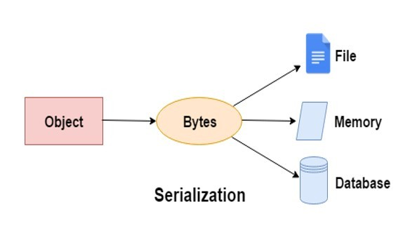

## Today I Learned

### **직렬화와 역직렬화**

> 직렬화

  

직렬화는 객체를 파일의 형태 등으로 저장하거나, 통신하기 쉬운 포맷으로 변환하는 과정을 의미합니다.

  

Serialization의 ‘Serial’은 연쇄. 연속해서 이어지는 어떤 것을 의미합니다.

이런 ‘Serial’이란 단어는 한국어로 직렬이라고 합니다.

  

직렬화의 대상인 Object는 메모리에 있고 형태가 추상적입니다.

그래서 이런 Object를 string 혹은 바이트(bytes) 형태로 직렬화를 해줍니다.

  

이렇게 직렬화를 거쳐 일련의 형태를 가진 데이터를 파일로 저장하거나 클라이언트에게 전송할 수 있습니다.

   

> 역직렬화

  

⁠직렬화 되어있는 데이터를 역으로 직렬화 하는 것을 의미합니다.

  

직렬화를 하는 과정에서 Json 형식으로 직렬화 할 지 아니면 Bytes 형식으로 할 지 정했습니다.

반대로 역직렬화를 할 때는 일련의 형식을 가진 데이터를 읽거나 메모리에 쓸 수 있도록 변환하는 것입니다.

  

직렬화 포맷에는 아래와 같은 형식들이 대표적입니다.

- Json
- XML
- CSV
- Byte

  

여기서 Json, XML, CSV는 사람이 읽을 수 있는 형태입니다.

하지만 String 형태로 저장이 되기 때문에 저장 공간의 효율성이 떨어지고, 비교적 파싱하는 시간이 오래 걸립니다.

  

반대로 Binary 직렬화는 사람이 읽기 힘든 형태입니다.

하지만 저장 공간을 효율적으로 사용할 수 있고, 비교적 파싱하는 시간이 빠릅니다.

  
 
  

> 직렬화를 하는 이유

  

디스크에 저장되어 있는 데이터는 직렬화를 거치면서 파싱이 가능한 유의미한 데이터가 됩니다.

  

이런 직렬화된 데이터를 특정 대상의 컴퓨터에 전송하면,

해당 포맷에 맞게 파싱을 해서 읽거나 쓰기가 가능해집니다.

  

이런 직렬화 포맷은 특정의 포맷이 성능상 더 좋아서 사용 하는 것이 아닌,

각 산업 분야에 맞춰서 사용하고 있습니다.

  

예를 들면 실시간 데이터 전송의 성능이 중요한 멀티플레이 RPG 게임은 바이너리 직렬화를 사용합니다.

  

하지만 웹 개발에서는 대부분 Json 포맷을 사용하고 있습니다.
