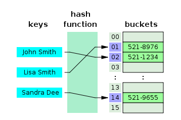
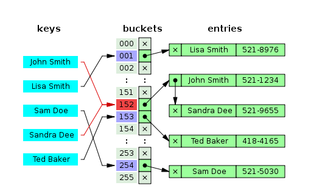
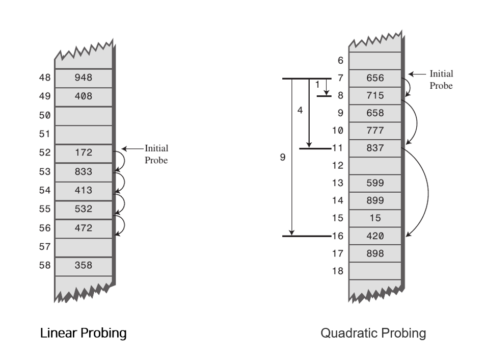

## Today I Learned

### **Hash Table**

참조 : [\[망나니 개발자 : 해시테이블\]](https://mangkyu.tistory.com/102 "https://mangkyu.tistory.com/102")

```
> **HashTable (해시 테이블) 이란?**
```


해시 테이블은 **\[Key, Value\]로 데이터를 저장**하는 자료구조 중 하나로 빠르게 데이터를 검색할 수 있는 자료구조입니다. 해시 테이블이 빠른 검색 속도를 제공하는 이유는 내부적으로 배열을 사용하여 데이터를 저장하기 때문입니다. 해시 테이블은 각각의 **Key 값에 해시함수를 적용**해 **배열의 고유한 Index를 생성**하고, 이 Index를 활용해 값을 저장하거나 검색하게 됩니다. 여기서 실제 값이 저장되는 장소를 버킷 또는 슬롯이라고 합니다.

<br>



<br>

해시 테이블은 이미지와 같이 **Index 접근이기 때문에 O(1)의 시간 복잡도**를 가집니다. 필자는 처음 해시테이블을 공부했을 때 Key 값을 해시 함수를 거쳐 Index 변환 후 해당 배열\[index\]로 접근하여  Value를 저장하는 것이라고 생각했는데 이러한 방법도 물론 있겠지만 보통 Key와 Value를 둘 다 저장한다고 합니다.

<br>

<br>

```
Hash 함수(해시 함수)
```

<br>

해시 함수에서 중요한 것은 고유한 인덱스 값을 설정하는 것입니다. 해시 테이블에 사용되는 대표적인 해시 함수로는 아래의 3가지가 있습니다.  

<br>

1. **Division Method** : 나눗셈을 이용하는 방법으로 입력값을 테이블의 크기로 나누어 계산합니다. (주소 = 입력값 % 테이블의 크기) 테이블의 크기를 소수로 정하고 2의 제곱수와 먼 값을 사용해야 효과가 좋다고 알려져 있습니다.

<br>

2. **Digit Folding** : 각 Key의 문자열을 ASCII 코드로 바꾸고 값을 합한 데이터를 테이블 내의 주소로 사용하는 방법입니다.

<br>

3. **Multiplication Method** : 숫자로 된 Key값 K와 0과 1사이의 실수 A, 보통 2의 제곱수인 m을 사용하여 다음과 같은 계산을 해줍니다. h(k)=(kAmod1) × m

<br>

4. **Univeral Hashing** : 다수의 해시함수를 만들어 집합 H에 넣어두고, 무작위로 해시함수를 선택해 해시값을 만드는 기법입니다.

<br>

<br>

```
> **해쉬 값이 충돌하는 경우**
```

<br>


**\[해쉬 값이 충돌하는 경우에는?\]**

만약 A와 B의 Key 값을 해시 함수 돌려 나온 값이 동일하다면 어떻게 해야 할까? 해시 테이블에서는 충돌에 의한 문제를 **분리 연결법\[Separate Chaining\]**과 **개방 주소법(Open Addressing)** 크게 두 가지로 해결하고 있다.

<br>


- 분리 연결법
    - 
    - 분리 연결법 즉 체이닝이란 동일한 버킷의 데이터에 대해 자료구조를 활용해 추가 메모리를 사용하여 다음 데이터의 주소를 저장하는 것입니다. 그림과 같이 동일한 버킷으로 접근을 한다면 **데이터들을 연결을 해서 관리**해주고 있습니다. 실제로 Java8의 HashTable은 Self-Balancing Binary Search Tree 자료구조를 사용해 체이닝 방식을 구현하였습니다.
    - 이러한 체이닝 방식은 해시 테이블의 확장이 필요없고 간단하게 구현이 가능하며, 손쉽게 삭제할 수 있다는 장점이 있습니다. 하지만 **데이터의 수가 많아지면 동일한 버킷에 체이닝이 되는 데이터가 많아지며 그에 따라 캐시의 효율성이 감소합니다.

<br>

<br>

- 개방 주소법
    - 
    - Open Addressing이란 추가적인 메모리를 사용하는 Chaining 방식과 다르게 비어있는 해시 테이블의 공간을 활용하는 방법이다. Open Addressing을 구현하기 위한 대표적인 방법으로는 3가지 방식이 존재한다.
    - **Linear Probing** : 현재의 버킷 index로부터 고정폭 만큼씩 이동하여 차례대로 검색해 비어 있는 버킷에 데이터를 저장한다.
    - **Quadratic Probing** : 해시의 저장순서 폭을 제곱으로 저장하는 방식이다. 예를 들어 처음 충돌이 발생한 경우에는 1만큼 이동하고 그 다음 계속 충돌이 발생하면 2^2, 3^2 칸씩 옮기는 방식이다.
    - **Double Hashing Probing** : 해시된 값을 한번 더 해싱하여 해시의 규칙성을 없애버리는 방식이다. 해시된 값을 한번 더 해싱하여 새로운 주소를 할당하기 때문에 다른 방법들보다 많은 연산을 하게 된다.